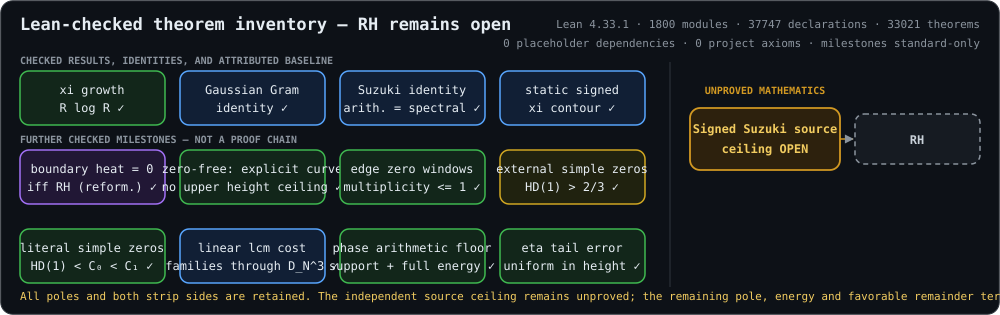

# RiemannGaussian

[](https://github.com/dbsanfte/RiemannGaussian/actions/workflows/lean_action_ci.yml)

RiemannGaussian is an open research project building toward a complete,
kernel-checked Lean proof of the Riemann hypothesis. The repository contains
the evolving Lean 4 proof development and supporting analytic and finite-model
theory. The proof is not complete; only declarations accepted by Lean and the
repository's verification gates count as established results.

> **Research agent:** GPT-5.6 Sol with **Max** reasoning effort, running in the
> **Codex CLI harness**.



This panel is generated from Lean's compiled environment. A checkmark means
that the named theorem is kernel-checked; it is not a measure of proximity to
RH. Its boxes are deliberately not connected as a proof chain: green denotes
unconditional analytic infrastructure, purple an RH-equivalent reformulation,
and blue/cyan verified identities or reductions. In particular, proving that
a detector is equivalent to RH does not establish either side. Orange is the
conjecture-strength open mathematics, and its dashed arrow is explicitly
unproved. No current theorem derives an RH-equivalent vanishing condition from
unconditional arithmetic estimates. CI rejects a stale generated panel. The
machine-readable companion is [docs/proof-status.json](docs/proof-status.json).

## Latest Update

Lean now optimizes the finite eta moment-tail split at each cutoff by taking
`theta_N = (m+1)/(sigma*log(2N+1))`. Past a proved explicit threshold, this
lies in `(0,1)` and converts the earlier fractional-exponent estimate into the
exact envelope
`exp(-sigma*log(2N+1)+(m+1))*m!*(log(2N+1)/(m+1))^(m+1)`.
Thus the bound retains the full horizontal exponent `sigma`, losing only a
fixed logarithmic power, and Lean proves that it tends to zero.

The sharper rate is propagated through the phase-sensitive finite lower
certificates and the full complex completed partner residual at complementary
tilts. Those certificates converge to the exact nonzero leading defect and
are eventually both valid and positive; the residual is eventually bounded
by the two full-exponent complementary envelopes. This is stronger finite
control, not a zero-location theorem: the same decay remains compatible with
an off-critical zero. The open step is an eta-specific lower or phase
incompatibility coupling the complementary tilts; no current theorem implies
RH.

## Mathematical Program

The development joins two lines of attack:

- The **Gaussian/Weil branch** formalizes subquadratic global growth of xi,
  convergence of its zero sums, an RH-equivalent boundary heat detector, and
  Gaussian Gram identities.
- The **Suzuki/contour branch** connects an arithmetic screw-line quantity to
  the spectral xi logarithmic derivative, constructs safe finite contours, and
  deforms the resulting static signed contour to its paired real-boundary
  limit.

Finite Hardy spaces, Blaschke products, Pick matrices, Gram determinants,
root-count transport, and finite-to-entire limit theory provide the supporting
formal infrastructure. These results expose several interfaces to the same
missing arithmetic and entire-function rigidity theorem; they do not yet
prove that theorem.

## Repository Structure

- [RiemannGaussian.lean](RiemannGaussian.lean) is the root library module and
  fixes the complete import graph built by CI.
- [RiemannGaussian/](RiemannGaussian/) contains the Lean proof modules.
  Module families named `Gaussian*`, `Finite*`, `RiemannXi*`, and
  `Suzuki*` correspond to the principal parts of the program.
- [scripts/GenerateProjectStatus.lean](scripts/GenerateProjectStatus.lean)
  audits the compiled environment and generates the status artifacts in
  [docs/](docs/).
- [scripts/LintProject.lean](scripts/LintProject.lean) runs all registered
  declaration linters over the complete project namespace.
- [AGENTS.md](AGENTS.md) records the proof discipline, workflow, and mandatory
  gates for research agents.
- [.github/workflows/lean_action_ci.yml](.github/workflows/lean_action_ci.yml)
  and [.githooks/pre-commit](.githooks/pre-commit) implement the remote and
  local verification gates.

## Rigor and Verification

The formal target is Mathlib's `RiemannHypothesis`. Every accepted proof
slice must preserve a continuous chain from imported Mathlib definitions to
the current frontier.

The enforced checks are:

- no Lean source may contain `sorry`, `admit`, or a direct use of Lean's
  unresolved-proof axiom;
- the entire library builds with warnings treated as errors;
- all registered project declaration linters pass;
- every compiled project declaration is audited for unresolved-proof
  dependencies, and project-defined axioms are rejected;
- displayed frontier theorems may depend only on Lean's standard
  `propext`, `Classical.choice`, and `Quot.sound` axioms;
- the generated SVG and JSON must exactly match the compiled environment; and
- GitHub Actions must pass on the exact pushed commit before another proof
  slice begins.

Numerical experiments, symbolic calculations, research notes, and literature
dispatches are used only to discover candidate mathematics. Nothing from them
is trusted until it has been re-derived in Lean and passed every gate.

## Build and Check

The project is pinned to Lean 4.33.1 and Mathlib 4.33.1. With
[elan](https://github.com/leanprover/elan) installed, run from the repository
root:

```bash
lake exe cache get
lake build --wfail
lake env lean -DwarningAsError=true scripts/LintProject.lean
lake env lean -DwarningAsError=true scripts/GenerateProjectStatus.lean
git diff --exit-code -- docs/proof-status.json docs/proof-status.svg
```

Enable the tracked pre-commit gate once per clone:

```bash
git config core.hooksPath .githooks
```

The hook repeats the source-placeholder scan, warning-as-error build,
whole-project lint, compiled-environment audit, dashboard freshness check, and
staged whitespace check. GitHub Actions remains authoritative because local
hooks can be bypassed.

## Research Method

Work proceeds in small theorem slices. Each slice isolates a real obstruction,
proves a reusable Lean lemma without weakening definitions or moving the
obstruction into assumptions, audits its axioms, runs all local gates, and is
then committed and pushed. Work resumes only after CI succeeds on that exact
commit.

The agent may explore new mathematics and connections to analysis, operator
theory, spectral theory, number theory, or mathematical physics. Such ideas
enter the project only through kernel-checked Lean proofs grounded in the
existing verified chain. See [AGENTS.md](AGENTS.md) for the full methodology.
