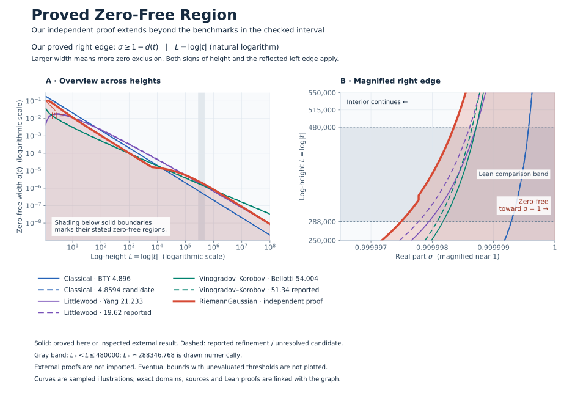
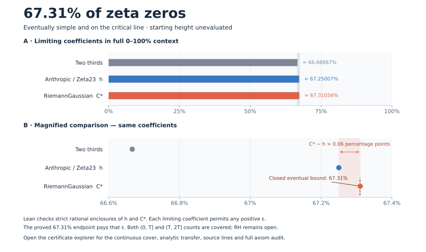
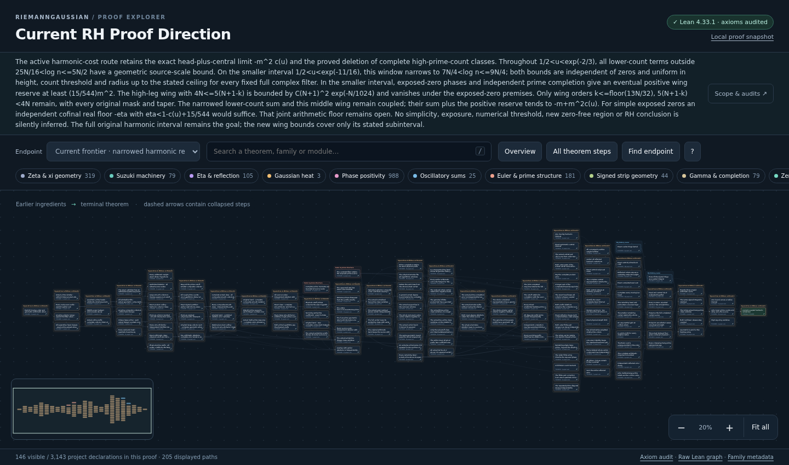

# RiemannGaussian

[](https://github.com/dbsanfte/RiemannGaussian/actions/workflows/lean_action_ci.yml)
[](LICENSE)

RiemannGaussian is an open research project building toward a complete,
kernel-checked Lean proof of the Riemann hypothesis. The repository contains
the evolving Lean 4 proof development and supporting analytic and finite-model
theory. The proof is not complete; in the meantime, the extensive Lean theorems and formalizations are provided to the wider community. Only declarations accepted by Lean and the
repository's verification gates count as established results.

> **Research agents:** GPT-5.6 Sol and GPT-6 Astra with **Max** reasoning effort, running in the
> **Codex CLI harness**.

## Proved Zero-Free Region

[](docs/zero-free-regions/comparison.svg)

**Coral shows our independently proved region.** Within the grey
Lean-checked interval, it extends beyond the combined benchmark regions
(blue, purple and green). Click the graph to enlarge it. Eventual components
with unevaluated starting heights are stated below and are not plotted.
[Graph data, sources and scope](docs/zero-free-regions/README.md)
· [Graph proof audit](docs/zero-free-regions/audit.json).

**Proved in Lean at every height:** every nontrivial zeta zero obeys

<table>
<tr><td>

```math
\boxed{\begin{gathered}
\rho=\beta+it,\qquad L(t)=\log(|t|+2),
\\[2pt]
C_1(L)=L+2052\log L+30240,
\\[2pt]
C_2(L)=L+1995\log L+29400,
\\[4pt]
d_1(t)=\min\!\left\{\frac{1}{450000},\frac{221}{250C_1(L(t))}\right\},
\\[2pt]
d_2(t)=\min\!\left\{\frac{1}{40500},\frac{1547}{1800C_2(L(t))}\right\},
\\[2pt]
P(L)=45750\max\{13/10,L\}-35725,
\\[2pt]
r_1(t)=\frac{792}{7625L(t)-2000},
\\[2pt]
r_2(t)=\min\!\left\{\frac{4}{39},\frac{4752}{P(L(t))}\right\},
\\[2pt]
d(t)=\max\{r_1(t),r_2(t),d_1(t),d_2(t)\},
\\[4pt]
d(t)\lt\beta\lt 1-d(t).
\end{gathered}}
```

</td></tr>
</table>

The complete endpoint preserves the stronger signed-pole/reserve proof at
modest heights and both Gaussian proofs at larger heights. Literal zeta
nonvanishing includes the closed right edge, with the pole `s = 1` excluded.
[Lean proof: exact_strip](RiemannGaussian/ZetaUnifiedZeroFree.lean)
· [Complete coverage and arithmetic consequences](docs/zeta-unified-zero-free.md).

The [Lean comparison](RiemannGaussian/ZetaGaussianExpandedComparison.lean)
now extends through **log-height 480,000**, from the earlier exact crossover.
The [literature-frontier table](docs/zero-free-literature-frontier.md) records
the full interval and source scope. This is a certified interval;
coverage of every benchmark at every height remains open.

**Proved eventual union, now including Vinogradov–Korobov:**

<table>
<tr><td>

```math
\boxed{\begin{gathered}
0\lt A\lt \frac{22\pi}{1525\log 2},
\\[2pt]
\frac1{1150}\le C\lt\frac{3\pi}{10640},\qquad \exists\,T(A,C)\ge 4,
\\[4pt]
w_C(t)=\frac{C}{L(t)^{2/3}(\log L(t))^{1/3}},
\\[4pt]
D_{A,C}(t)=\max\!\left\{d(t),\ A\frac{\log\log|t|}{\log|t|},\ w_C(t)\right\},
\\[4pt]
|t|\ge T(A,C)\quad\Longrightarrow
\\[4pt]
D_{A,C}(t)\lt \beta\lt 1-D_{A,C}(t).
\end{gathered}}
```

</td></tr>
</table>

Every arithmetic and analytic premise is discharged, and literal zeta
nonvanishing includes the closed right edge. **The eventual starting height
has not been numerically evaluated.** Summing the scale-dependent Dirichlet savings gives the classical
two-thirds logarithmic growth factor; signed angular control and a joint
degree and height schedule give the displayed VK family.
It eventually exceeds every fixed earlier log-log coefficient, but its constant
does not match published VK benchmarks. The interior strip and RH remain open.

[Lean proof: complete eventual union](RiemannGaussian/ZetaVinogradovSummedZeroFree.lean)
· [Constants, joint height schedule and scope](docs/vinogradov-zero-free.md)
· [Explore the new VK proof](https://dbsanfte.github.io/RiemannGaussian/#endpoint=vk-region).

### [▶ Open the interactive theorem explorer](https://dbsanfte.github.io/RiemannGaussian/)

[](https://dbsanfte.github.io/RiemannGaussian/)

Zoom, expand branches, inspect theorem metadata and open exact Lean source lines.
[Family metadata](docs/theorem-explorer/metadata.json)
· [Proof audit](docs/theorem-explorer/audit.json)
· [Reproduce locally](docs/theorem-explorer.md).

## Proved Numerical Certificate: 67.31%

[](https://github.com/dbsanfte/RiemannGaussian/actions/workflows/numerical_certificate.yml)

**Lean proves that at least 67.31% of zeta zeros are simple and on the critical
line**, in every sufficiently large cumulative `(0, T]` and dyadic `(T, 2T]`
window. The denominator counts analytic multiplicity; **the starting height
is unevaluated**. This improves Anthropic/Zeta23's two-thirds certificate,
including its stronger underlying coefficient of approximately **67.25007%**.

### [▶ Explore the 67.31% certificate proof](https://dbsanfte.github.io/RiemannGaussian/numerical-certificate/)

[](https://dbsanfte.github.io/RiemannGaussian/numerical-certificate/)

Click the chart to inspect the continuous cover, analytic transfer, exact
Lean source lines and proof audits.
[Enlarge chart](docs/numerical-certificate/comparison.svg)
· [Lean proof](RiemannGaussian/External/Zeta23SevenWindowIntegerCertificate.lean)
· [Successful complete verification](https://github.com/dbsanfte/RiemannGaussian/actions/runs/34802730942)
· [Full axiom audit](docs/numerical-certificate-audit.json)
· [Sources, metadata and reproduction](docs/numerical-certificate.md).

<!-- RH_DIRECTION:START -->
## Current RH Proof Direction

### [▶ Explore the current RH proof chain](https://dbsanfte.github.io/RiemannGaussian/rh-proof/)

[](https://dbsanfte.github.io/RiemannGaussian/rh-proof/)

The harmonic-cost route retains its evaluated source and an open independent -3/40 floor. The all-count parity packet has proved support-tail and factorial-error bounds, but its coupled masked phase estimate remains open. Radial and filter audits rule out the proposed transfers from complete prime-leg limits; any continuation must control the literal joint response and the signed rest.

[Direction and remaining obstruction](docs/rh-proof-direction.md)
· [Campaign metadata](docs/rh-proof-explorer/metadata.json)
· [Proof audit](docs/rh-proof-explorer/audit.json).

### Latest Update

**Masked two-mode bound proved; radial and filter transfers audited.** Lean proves a positive radial model exponent, a masked two-mode bound, and the exact distinction between total-order and per-leg filtering. A synthetic multi-rightward family defeats every uniform squared-displacement/gain bound. Optional numerical probes quantify these obstructions.
The actual filtered packet is neither bounded nor disproved here. Pole-containing mixtures, the projected residual and the one-sided cutoff boundary remain unpaid. No signed floor or new zero exclusion is claimed.
[Current checked endpoint](RiemannGaussian/ZetaRieszFilteredMaskAudit.lean#L213)
· [Proof details](docs/zeta-riesz-pole-jet-half-plane-audit.md).
<!-- RH_DIRECTION:END -->

## Notable Formalisations

Ten major results and frameworks. The linked Lean sources state their exact
hypotheses; the [family index](docs/theorem-families/README.md) covers the full library.

| Area | What is formalised | Lean entry points |
| --- | --- | --- |
| **Complete zero-free region** | The all-height region, the eventual Littlewood/VK union, both reflected edges, and the existing explicit-region arithmetic radius. Threshold scope is stated above. | [explicit region](RiemannGaussian/ZetaUnifiedZeroFree.lean), [eventual union](RiemannGaussian/ZetaVinogradovSummedZeroFree.lean), [arithmetic transport](RiemannGaussian/ZetaSquarefreeUnifiedRegion.lean) |
| **67.31% numerical certificate** | At least 67.31% of zeros are simple and on the critical line in sufficiently large cumulative and dyadic windows. The threshold is unevaluated; exhaustive verification is optional. | [literal-count certificate](RiemannGaussian/External/Zeta23SevenWindowIntegerCertificate.lean) |
| **Gaussian/Weil explicit formula** | The arithmetic Gaussian expression, including prime-power and Archimedean terms, equals the complete multiplicity-weighted symmetric zero sum for every positive width. | [canonical explicit formula](RiemannGaussian/GaussianXiLogDerivativeGrowth.lean#L1235) |
| **Gaussian heat and reflected-zero Grams** | The complete Gaussian correlation equals the boundary heat-residue sum. Its vanishing at positive heat time is equivalent to RH; that vanishing remains unproved. | [correlation identity and RH equivalence](RiemannGaussian/RiemannXiBoundaryGaussianGram.lean#L187) |
| **Suzuki arithmetic and spectral formulas** | Suzuki's arithmetic function equals its spectral expansion in the safe half-plane. The literal arithmetic Psi is strictly positive on a nonzero punctured neighbourhood of the origin. | [spectral identity](RiemannGaussian/RiemannXiSuzukiWeilVerticalLimit.lean#L462), [local positivity](RiemannGaussian/RiemannXiSuzukiPointwiseLocalPositivity.lean#L298) |
| **Vinogradov moments and Dirichlet sums** | Explicit degree-dependent moments and actual damped Dirichlet savings feed a proved VK zero-free region. Its coefficient is conservative and its starting height unevaluated. | [moment and block bounds](docs/vinogradov-narrow-packet.md), [complete zero-free proof](docs/vinogradov-zero-free.md) |
| **Exact phase optimiser and arithmetic floor** | The specified phase cost has a unique eight-frequency optimiser across all feasible finite or infinite integer-frequency families, with a proved arithmetic floor. | [exact optimiser](RiemannGaussian/ZetaPhaseExactOptimizer.lean), [arithmetic floor and exclusion criterion](RiemannGaussian/ZetaPhaseBinomialScale.lean) |
| **Eta heat and continuous phase matrices** | Exact eta heat/spectral correspondence and small-width matrix coercivity for distinct integer probes retain the full complex Gram correlations. | [heat/spectral identity](RiemannGaussian/EtaSupportGapGaussianSpectral.lean), [continuous matrix coercivity](RiemannGaussian/Hybrid/EtaSupportGapPhaseCoercivity.lean#L276) |
| **Original signed Riesz carrier bound** | Critical moments plus positive ε and a proved negative initial-energy profile bound the actual carrier. Signed correlation and sampling costs still need a combined saving. | [actual carrier bound](RiemannGaussian/ZetaRieszCriticalProfile.lean), [preserved source](RiemannGaussian/ZetaRieszConditionedEnergy.lean) |
| **Montgomery–Vaughan weighted Hilbert inequality** | An attributed Apache-2.0 formalisation with exact diagonal constant 13 and bilinear constant 26. | [both inequalities](RiemannGaussian/MontgomeryVaughan/Final.lean#L28) |

## Accomplishments

Ten major results, selected for mathematical significance. Detailed auxiliary
results and their exact scope remain in the [family index](docs/theorem-families/README.md)
and the [proof inventory](docs/proof-status.json).

- **A proved explicit zero-free region at every height.** The
  [complete explicit region](RiemannGaussian/ZetaUnifiedZeroFree.lean)
  and [proved eventual Littlewood/Vinogradov–Korobov union](RiemannGaussian/ZetaVinogradovSummedZeroFree.lean)
  form the region displayed above. Eventual thresholds are unevaluated.
  The [extended comparison](RiemannGaussian/ZetaGaussianExpandedComparison.lean)
  and [literature audit](docs/zero-free-literature-frontier.md) state precisely
  which benchmark functions it improves and where.
- **The critical high-order Vinogradov moment exponent, with every positive ε.**
  [The global theorem](RiemannGaussian/VinogradovCriticalExponent.lean)
  covers every k≥2, u≥k at all sufficiently large endpoints without an
  assumed moment estimate. A [finite descent](docs/vinogradov-linear-constants.md)
  now retains the cost A^n·k! at every positive integer cutoff, with an
  explicit profile multiplier. A [quantitative continuation](docs/vinogradov-narrow-packet.md)
  now pays all degree-dependent moment coefficients at the stated order.
  The full Gaussian degree window now also gives a [power saving for original
  Dirichlet blocks](docs/vinogradov-gaussian-power-saving.md) throughout the
  stated continuous intervals, including the actual zeta damping. Gaussian
  costs and the complete original block estimate have explicit constants.
- **At least 67.31% of nontrivial zeros are simple and on the critical line.**
  [The literal-count theorem](RiemannGaussian/External/Zeta23SevenWindowIntegerCertificate.lean)
  proves this for every sufficiently large cumulative or dyadic window.
  The starting height is unevaluated. We reproduce the
  [Anthropic/Zeta23 baseline](RiemannGaussian/External/Zeta23Baseline.lean)
  and improve it with unequal seven-point weights and a complete checked cover.
  [Exact coefficient, provenance and optional cached verification](docs/numerical-certificate.md).
  No `13/18` certificate is claimed.
- **An exact phase optimiser over all admissible integer frequencies.**
  [existsUnique_phaseContactOptimizer](RiemannGaussian/ZetaPhaseExactOptimizer.lean)
  proves existence and uniqueness, including infinite competitors, for the
  specified cost and shift. Its tiny higher frequencies are necessary for
  that optimum; this is not an intrinsic frequency count for zeta zeros.
- **A complete Gaussian prime identity coupled to the signed strip detector.**
  [The complex identity](RiemannGaussian/ZetaGaussianSmoothedIdentity.lean)
  retains the actual prime series, xi response, pole and completion.
  [The full phase-family theorem](RiemannGaussian/ZetaGaussianStripPhaseFamily.lean)
  couples all three arithmetic responses before using positivity, preserving
  selected zeros and multiplicities in the chain to the proved region.
- **A height-uniform direct zeta truncation remainder.**
  [norm_remainder_le_power](RiemannGaussian/ZetaEulerUniformRemainder.lean)
  bounds the actual Euler remainder by `(N+1)^(-Re(s))` throughout
  `0<Re(s)<=1` once `N+1>=abs(Im(s))`. Its Fourier argument feeds the
  actual line estimates and general phase-family budgets.
- **Uniform decay of the complete squarefree divisor matrix.**
  [The actual band transport](RiemannGaussian/ZetaSquarefreeGaussianBand.lean)
  and [moving-matrix theorem](RiemannGaussian/ZetaSquarefreeGaussianSieve.lean)
  give one vanishing allowance across the explicit center band, including
  moving selected zeros, cutoffs and bounded complex weights. Ordinary
  primes remain included; the independent isolated prime-tail bound is open.
- **A uniform critical heat law on the literal eta support.**
  [The Gaussian leakage theorem](RiemannGaussian/EtaSupportGapGaussian.lean#L349)
  has one explicit error bound for every ordinate. Its
  [spectral identity](RiemannGaussian/EtaSupportGapGaussianSpectral.lean)
  retains the actual eta/gap correlation, and the
  [signed polynomial heat law](RiemannGaussian/EtaPolynomialHeatReflection.lean)
  preserves the reflected endpoint structure.
- **Quantitative positivity for the full continuous eta phase matrix.**
  [The coercivity theorem](RiemannGaussian/Hybrid/EtaSupportGapPhaseCoercivity.lean#L276)
  retains all mixed phase interference and an explicit dimension cost.
  [The cubic-phase extension](RiemannGaussian/Hybrid/EtaCubicHeatGram.lean)
  proves convergence of the full mixed matrix and positivity of its limit.
  This auxiliary positivity does not close the reflected RH criterion.
- **Geometric separation of literal eta features for every finite zero window.**
  [The packed-feature rank theorem](RiemannGaussian/Hybrid/EtaGeometricPackedFeatureRank.lean#L210)
  supplies one odd prime sampling base making all sufficiently late feature
  blocks linearly independent, with completion factors retained. It
  distinguishes the represented zeros without implying they lie on the
  critical line.

All entries have checked Lean proofs. Attribution is explicit for external
results; wider priority of the project-developed auxiliary mathematics has
not been established. RH remains open.

## Repository Structure

**[Browse the complete theorem-family index](docs/theorem-families/README.md)**
for Gaussian heat, Suzuki, eta, phase positivity, hybrid matrices, arithmetic
and the other families. It is generated from the explorer's shared metadata.

| Location | Contents |
| --- | --- |
| [RiemannGaussian/](RiemannGaussian/) · [root imports](RiemannGaussian.lean) | Lean sources, including the `Hybrid`, `HermitianRankTrace`, `MontgomeryVaughan` and `External` subdirectories |
| [docs/](docs/) · [theorem explorer](docs/theorem-explorer/) | Proof notes, literature audits, family indexes and generated proof metadata |
| [vendor/zeta23/](vendor/zeta23/) | Pinned external proofs, licenses and provenance |
| [scripts/](scripts/) | Lean audits, metadata generation and browser checks |
| [.github/workflows/](.github/workflows/) · [.githooks/](.githooks/) | Remote and local verification gates |
| [.devcontainer/](.devcontainer/) · [AGENTS.md](AGENTS.md) | Development environment and proof-maintenance rules |

## Rigor and Verification

The formal target is Mathlib's `RiemannHypothesis`. Every accepted proof
slice must preserve a continuous chain from imported Mathlib definitions to
the current frontier.

The enforced checks are:

- no Lean source may contain `sorry`, `admit`, or a direct use of Lean's
  unresolved-proof axiom;
- the entire library builds with warnings treated as errors;
- all registered project declaration linters pass;
- every compiled project declaration is audited for unresolved-proof
  dependencies, and project-defined axioms are rejected;
- displayed frontier theorems may depend only on Lean's standard
  `propext`, `Classical.choice`, and `Quot.sound` axioms;
- the generated SVG and JSON must exactly match the compiled environment; and
- GitHub Actions must pass on the exact pushed commit before it is reported
  as remotely verified; local proof work can continue while CI runs.

Numerical experiments, symbolic calculations, research notes, and literature
dispatches are used only to discover candidate mathematics. Nothing from them
is trusted until it has been re-derived in Lean and passed every gate.

## Build and Check

The project is pinned to Lean 4.33.1 and Mathlib 4.33.1. With
[elan](https://github.com/leanprover/elan) installed, run from the repository
root:

```bash
lake exe cache get
lake build --wfail
lake env lean -DwarningAsError=true scripts/LintProject.lean
lake env lean -DwarningAsError=true scripts/GenerateProjectStatus.lean
git diff --exit-code -- docs/proof-status.json docs/proof-status.svg
```

Enable the tracked pre-commit gate once per clone:

```bash
git config core.hooksPath .githooks
```

The hook repeats the source-placeholder scan, warning-as-error build,
whole-project lint, compiled-environment audit, dashboard freshness check, and
staged whitespace check. GitHub Actions remains authoritative because local
hooks can be bypassed.

## Research Method

Work proceeds in small theorem slices. Each slice isolates a real obstruction,
proves a reusable Lean lemma without weakening definitions or moving the
obstruction into assumptions, audits its axioms, runs all local gates, and is
then committed and pushed. Work resumes only after CI succeeds on that exact
commit.

Every representation is treated as an information-flow decision. Rich source
objects are retained while norms, traces, asymptotic limits, and triangle
bounds are exposed only as downstream views; phase, sign, orientation,
multiplicity, scale, and channel colour are collapsed only when a proved
estimate gains leverage from doing so.

Lean is also used as a research engine for deriving and testing new
mathematics across analysis, operator theory, spectral theory, number theory,
and mathematical physics. Numerical or symbolic experiments may suggest a
lemma, but only a kernel-checked theorem grounded in the existing chain counts
as progress. See [AGENTS.md](AGENTS.md) for the full methodology.

## License

Copyright 2026 David Sanftenberg.

RiemannGaussian is licensed under the [Apache License, Version 2.0](LICENSE)
(`Apache-2.0`). Third-party source retains its original copyright and
attribution notices; see the notices for
[Zeta23](vendor/zeta23/NOTICE),
[HermitianRankTrace](RiemannGaussian/HermitianRankTrace/NOTICE), and
[MontgomeryVaughan](RiemannGaussian/MontgomeryVaughan/NOTICE).
