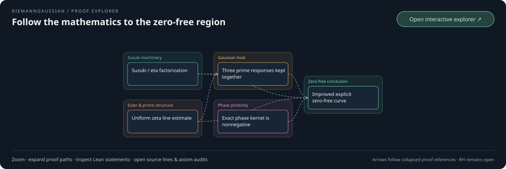

# RiemannGaussian

[](https://github.com/dbsanfte/RiemannGaussian/actions/workflows/lean_action_ci.yml)
[](LICENSE)

RiemannGaussian is an open research project building toward a complete,
kernel-checked Lean proof of the Riemann hypothesis. The repository contains
the evolving Lean 4 proof development and supporting analytic and finite-model
theory. The proof is not complete; in the meantime, the extensive Lean theorems and formalizations are provided to the wider community. Only declarations accepted by Lean and the
repository's verification gates count as established results.

## Zero-free region

**Proved in Lean, with explicit heights:** every nontrivial zeta zero obeys

<table>
<tr><td>

```math
\boxed{\begin{gathered}
\rho=\beta+it,\qquad 10^6\le |t|,
\\[2pt]
\log(|t|+2)\le 320000
\\[4pt]
\Longrightarrow\qquad \frac{1}{450000}\lt \beta\lt 1-\frac{1}{450000}.
\end{gathered}}
```

</td></tr>
</table>

Lean also proves literal zeta nonvanishing on the closed right edge.
[Band proof](RiemannGaussian/ZetaGaussianBandExclusion.lean)
· [Complete cost and comparison](docs/zeta-gaussian-phase-band.md).

**Exact benchmark crossover:** Lean proves strict improvement over the
listed classical, Littlewood, Vinogradov–Korobov and intermediate width
functions throughout

<table>
<tr><td>

```math
\boxed{\begin{gathered}
L=\log|t|,\qquad L_*\lt L\le L_{\max},
\\[4pt]
\frac{981}{50}L_*=450000\log L_*,
\\[2pt]
288000\lt L_*\lt 289000,
\\[4pt]
L_{\max}=\log\!\left(e^{320000}-2\right).
\end{gathered}}
```

</td></tr>
</table>

At the unique crossover the strongest headline comparison ties; the upper
endpoint is included exactly.
[Lean comparison](RiemannGaussian/ZetaGaussianBandFrontier.lean)
· [Literature-frontier table and source audit](docs/zero-free-literature-frontier.md).
The table records the comparison's coverage and unresolved source checks;
an exhaustive world-record claim remains unestablished.

**Eventual component:** for each fixed admissible coefficient, Lean also proves

<table>
<tr><td>

```math
\boxed{\begin{gathered}
0\lt A\lt \frac{22\pi}{1525\log 2},\qquad \exists\,T(A)\ge 2,
\\[4pt]
|t|\ge T(A)\quad\Longrightarrow
\\[4pt]
A\frac{\log\log |t|}{\log |t|}\lt \beta
\lt 1-A\frac{\log\log |t|}{\log |t|}.
\end{gathered}}
```

</td></tr>
</table>

This excludes a region adjoining each edge of the critical strip. Lean also
proves literal zeta nonvanishing on the corresponding closed right edge,
with every arithmetic and analytic premise discharged.
**This coefficient-dependent threshold has not been numerically evaluated.**
On overlaps the two components combine by their larger width, with both
height conditions preserved. The remaining interior strip is unresolved,
and RH remains open.

[Lean proof: exists_eventual_strip](RiemannGaussian/ZetaLogLogZeroFree.lean#L62)
· [Joint order-height proof and arithmetic consequences](docs/zeta-log-log-zero-free.md).

> **Research agents:** GPT-5.6 Sol and GPT-6 Astra with **Max** reasoning effort, running in the
> **Codex CLI harness**.

### [▶ Open the interactive theorem explorer](https://dbsanfte.github.io/RiemannGaussian/)

[](https://dbsanfte.github.io/RiemannGaussian/)

Zoom, expand branches, inspect theorem metadata and open exact Lean source lines.
[Family metadata](docs/theorem-explorer/metadata.json)
· [Proof audit](docs/theorem-explorer/audit.json)
· [Reproduce locally](docs/theorem-explorer.md).

## Current Direction

Use the explicit Gaussian zero-free region and uniform moving-height arithmetic bounds to attack the independent ordinary-prime floor, preserving prime phases and the complete divisor correlation. The full matrix has a common decay allowance across the explicit center band. Exact benchmark comparisons now cover the crossover through the true ceiling; the isolated prime tail and RH remain open.

## Latest Update

**The comparison now covers its exact crossover-to-ceiling interval.**
Lean proves existence and uniqueness of the crossover, its endpoint equality,
strict improvement above it, and the exact upper height correction. The
[literature table](docs/zero-free-literature-frontier.md) records primary
sources, height ranges, boundary conventions and the limits of the audit.

The same slice transports the proved region into a uniform bound for the
actual squarefree quotient and a common vanishing allowance for the complete
logarithmic divisor matrix, including moving selected zeros, cutoffs and
complex weights. The signed prime envelope and polynomial cost remain explicit.
[Band transport](RiemannGaussian/ZetaSquarefreeGaussianBand.lean)
· [Moving Möbius matrix families](RiemannGaussian/ZetaSquarefreeGaussianSieve.lean)
· [Exact arithmetic scope](docs/zeta-squarefree-gaussian-band.md).

This strengthens the already controlled matrix response. The independent
one-sided bound for the isolated ordinary-prime tail remains open. The
zero-free region above is unchanged, and RH remains open.

## Notable Formalisations

Selected entry points into the Lean library are listed below. Each link names
a compiled theorem; its source records the precise domains and hypotheses.

| Area | What is formalised | Lean entry points |
| --- | --- | --- |
| **Explicit Gaussian zero-free band from the complete phase-family cost** | Every eligible countable family in a coarse coefficient class has full cost at most `47500`, below the selected source `48000`. The existing exact family proves the explicit band above. All three prime responses remain coupled before positivity; the Euler charge falls only on the constant channel. Exact comparison inequalities and union with the eventual region are proved. | [complex family arithmetic](RiemannGaussian/ZetaGaussianPhaseArithmetic.lean), [coupled right response](RiemannGaussian/ZetaGaussianPhaseAllowance.lean), [full signed family](RiemannGaussian/ZetaGaussianStripPhaseFamily.lean), [actual band](RiemannGaussian/ZetaGaussianBandExclusion.lean), [scope](docs/zeta-gaussian-phase-band.md) |
| **Original Gaussian prime identity and complete strip bridge** | One complex Gaussian average connects the actual prime series, full xi response, pole and completion. Arbitrary finite zero groups retain their ordinates and multiplicities in the signed strip bound; the entire nearby divisor reaches Gaussian compensation. Exact pole recombination and explicit completion and distant-zero allowances retain the selected source at Euler centers. | [complex averages](RiemannGaussian/GaussianComplexPoleAverage.lean), [actual identity](RiemannGaussian/ZetaGaussianSmoothedIdentity.lean), [finite divisor groups](RiemannGaussian/ZetaStripFiniteSource.lean), [terminal bound](RiemannGaussian/ZetaGaussianStripBound.lean), [scope](docs/zeta-gaussian-strip-bridge.md) |
| **Complete nearby Gaussian-cotangent compensation** | A general analytic half-disc theorem controls the full blended source through its removed pole. Every nearby actual zero is compensated by its own retained Poisson mass; any finite selection keeps its exact source and multiplicities in the full signed bound. The selected cotangent loss is explicitly linear in its distance from one. | [regular correction](RiemannGaussian/CotangentRegularization.lean), [general minimum principle](RiemannGaussian/AnalyticHalfDiscMinimum.lean), [source bound](RiemannGaussian/SmoothedCotangentSource.lean), [actual cancellation](RiemannGaussian/ZetaGaussianNearCancellation.lean), [scope](docs/zeta-gaussian-near-cancellation.md) |
| **Complete Gaussian zero mass and explicit smoothing remainder** | Exact complex endpoints give cubic pole-remainder decay. An all-window cosine theorem proves the sign of every actual Gaussian zero contribution. Complete multiplicity-weighted summability, finite-window limits and near/far identities retain the complex correction; a shifted Poisson comparison gives an elementary half-logarithmic outside allowance. | [complex endpoints](RiemannGaussian/GaussianComplexHalfMoments.lean), [all-window sign](RiemannGaussian/PositiveCosineLaplace.lean), [actual mass](RiemannGaussian/ZetaGaussianLaplaceMass.lean), [complete remainder bound](RiemannGaussian/ZetaGaussianDistanceRemainder.lean), [scope](docs/zeta-gaussian-pole-remainder.md) |
| **Complete phase-family strip budget and explicit zero exclusion** | The exact cotangent source reaches a proved elementary upper bound for every eligible countable family. The right prime phases cost only the constant channel; rational corrections decay and the center has favorable sign. The full signed budget improves with retained negative depth. A strict explicit surplus proves actual closed-edge nonvanishing. | [signed and elementary budgets](RiemannGaussian/ZetaStripPhaseFamily.lean), [zero exclusion](RiemannGaussian/ZetaStripPhaseExclusion.lean), [all-family left means](RiemannGaussian/ZetaClippedEulerFamily.lean), [right correction](RiemannGaussian/ZetaRegularizedSechMean.lean), [scope](docs/zeta-strip-phase-budget.md) |
| **Actual strip zero constraint with complete vertical integrals** | The exact boundary map, Jacobian and dominated radial limits connect the full-multiplicity cotangent source to the two vertical integrals. The right sign is unchanged; arbitrary left negative depth is retained, with a proved monotone improvement as more depth is included. All analytic limits and integral side conditions are discharged. | [boundary geometry](RiemannGaussian/AnalyticStripBoundary.lean), [integral substitution](RiemannGaussian/AnalyticStripBoundaryIntegral.lean), [actual limits](RiemannGaussian/ZetaStripBoundaryLimit.lean), [zero constraint](RiemannGaussian/ZetaStripBoundaryConstraint.lean), [scope](docs/zeta-strip-boundary-constraint.md) |
| **Complete strip divisor and exact cotangent source** | The full disc-to-strip map preserves analytic order. Every finite actual zeta identity retains its complete divisor, complex boundary moment and rational pole correction. All zero terms have favorable sign; the selected term has an exact positive cotangent limit with its full multiplicity. A uniform signed envelope controls the infinite ends. | [map](RiemannGaussian/AnalyticStripMap.lean), [finite actual divisor](RiemannGaussian/ZetaStripDisc.lean), [selected limit](RiemannGaussian/ZetaStripCotangentSource.lean), [signed envelope](RiemannGaussian/ZetaStripBoundaryEnvelope.lean), [scope](docs/zeta-strip-cotangent-source.md) |
| **Coupled right boundary for every summable phase family** | The original vertical kernel has a strictly positive gamma norm-square Fourier transform. Exact logarithmic Euler expansion and justified infinite exchanges preserve the full phase kernel. The entire negative nonconstant boundary costs only the constant channel's averaged mass, bounded by its real-axis logarithm. | [complex transform](RiemannGaussian/SechVerticalFourier.lean), [actual prime series](RiemannGaussian/ZetaLogPrimeSeries.lean), [averaged boundary](RiemannGaussian/ZetaSechPrimeBoundary.lean), [all-family integral theorem](RiemannGaussian/ZetaSechPhaseFamily.lean), [scope](docs/zeta-sech-phase-boundary.md) |
| **Direct Euler growth through the full phase-family detector** | The actual all-order line bound has constant `8192` and no eta denominator. Exact pole cancellation controls low heights; the improvement reaches the Gaussian disc and every eligible countable family, preserving the zero source and radial correction. | [line bound](RiemannGaussian/ZetaEulerLineBound.lean), [pole-cleared profile](RiemannGaussian/ZetaEulerLogProfile.lean), [actual disc](RiemannGaussian/ZetaEulerGaussianDisc.lean), [complete family budget](RiemannGaussian/ZetaEulerAngularPhaseFamily.lean) |
| **Exact vertical detector moments and signed zeta windows** | The actual density has mass one, first absolute moment `log(2)` and an exact logistic tail. The Euler profile bounds every finite signed zeta window with a quadratic plus exponential pole allowance; all negative logarithmic mass is retained. | [moments and tails](RiemannGaussian/SechVerticalMoments.lean), [normalized original bound](RiemannGaussian/ZetaSechExactMass.lean), [actual signed Euler bound](RiemannGaussian/ZetaSechEulerBound.lean), [scope](docs/zeta-sech-euler-bound.md) |
| **Uniform direct zeta truncation with its full complex remainder** | On `0<Re(s)<=1`, a cutoff `N+1>=abs(Im(s))` gives `norm(R_N(s))<=(N+1)^(-Re(s))`. Exact Euler endpoints, absolute Fourier convergence, both frequency signs and cross-cell cancellation are proved for actual zeta. This classical analytic input removes the eta division loss from the reconstruction step. | [actual uniform theorem](RiemannGaussian/ZetaEulerUniformRemainder.lean), [complete oscillatory tail](RiemannGaussian/ZetaEulerOscillation.lean), [Fourier exchange](RiemannGaussian/ZetaEulerFourier.lean), [coupled phase primitive](RiemannGaussian/OscillatoryPowerPrimitive.lean) |
| **Exact Gaussian correction in the full phase-family bound** | Retaining the real quadratic and actual rational inverse gives a correction at most two, saving at least twelve logarithmic units per nonconstant channel. The improvement reaches the actual finite-height zero inequality for every eligible family. | [actual full-disc bound](RiemannGaussian/ZetaGaussianSharpDisc.lean), [complete phase budget](RiemannGaussian/ZetaSharpAngularPhaseFamily.lean) |
| **General phase families and the exact center shift** | Every nonnegative summable phase family with a nonnegative kernel, nonzero frequencies at least one and finite logarithmic frequency cost has a complete actual source bound. The leading cost depends on total nonconstant mass. An exact square proves the unique optimal center shift; the existing contact family supplies the region displayed above. | [source and radial correction](RiemannGaussian/ZetaAngularPhaseFamily.lean), [shift optimizer](RiemannGaussian/PhasePoleMargin.lean), [whole-family limit](RiemannGaussian/ZetaAngularPhaseLimit.lean), [actual exclusion](RiemannGaussian/ZetaAngularPhaseExclusion.lean), [exact-family application](RiemannGaussian/ZetaExactPhaseAngularExclusion.lean) |
| **Exact complex boundary moment and opposite semicircle bounds** | The first angular log-norm moment and complete canonical divisor recover the whole complex logarithmic derivative. Upper growth on the left and a lower logarithmic bound on the right give the signed allowance `2*(B+C)/(pi*R)`. Actual Euler and Gaussian estimates discharge both bounds and supply the general phase-family theorem. | [complex identity](RiemannGaussian/AnalyticDiscBoundaryMoment.lean), [exact semicircle masses](RiemannGaussian/SignedCircleProjection.lean), [general bound](RiemannGaussian/AnalyticDiscSignedBoundary.lean), [actual zeta bound](RiemannGaussian/ZetaNearOneAngularBound.lean), [prime budget](RiemannGaussian/ZetaAngularPrimeBudget.lean) |
| **Complete signed control at the strip-width radius** | Zero-free circles approach the full analytic radius despite possible outer-boundary zeros. Sharp canonical control retains the complex divisor identity on each circle; the scalar limit preserves multiplicity and the exact radial correction. This supplies the radius geometry used by the angular bound. | [general circles and limit](RiemannGaussian/AnalyticDiscBoundarySequence.lean), [canonical control](RiemannGaussian/AnalyticDiscCanonicalControl.lean), [actual full disc](RiemannGaussian/ZetaNearOneFullDisc.lean) |
| **Sharp one-sided analytic derivative control** | An arbitrary positive-radius disc and a bound on the real part suffice to control the full complex center derivative with the classical constant two. The normalized logarithm pays its actual center cost; the estimate strengthens the complete zeta exclusion chain. | [general derivative theorem](RiemannGaussian/AnalyticDiscCaratheodory.lean), [nonvanishing analytic functions](RiemannGaussian/AnalyticDiscLogarithm.lean), [actual canonical residual](RiemannGaussian/ZetaNearOneCanonical.lean), [scope](docs/zeta-caratheodory-zero-free.md) |
| **Joint order-height control and log-log zero exclusion** | Every fixed logarithmic power is absorbed by the complete moving reciprocal-radius cost. The full center and evaluation-height corrections vanish; the actual prime budget then proves the region displayed above with its entire open coefficient range. | [all-order schedule](RiemannGaussian/LogLogDerivativeSchedule.lean), [full correction decay](RiemannGaussian/ZetaLogLogCorrection.lean), [complete prime budget](RiemannGaussian/ZetaLogLogBudget.lean), [ordinary width and complete bands](RiemannGaussian/ZetaLogLogZeroFree.lean), [scope](docs/zeta-log-log-zero-free.md) |
| **Complete signed local factorization** | Complete canonical factorization retains each pole and correction together with its multiplicity. Actual Gaussian growth and the Euler center bound control the analytic residual. Every other coupled zero term has nonnegative real contribution, preserving the selected reciprocal-distance source. | [general complex identity](RiemannGaussian/AnalyticDiscSignedDerivative.lean), [actual signed bound](RiemannGaussian/ZetaNearOneSignedBound.lean), [complete prime budget](RiemannGaussian/ZetaNearOnePhaseConstraint.lean), [use in zero exclusion](docs/zeta-log-log-zero-free.md) |
| **Gaussian strip bounds and shrinking-disc zero estimates** | The all-order zeta line bound propagates across a full strip using an exact Gaussian carrier and a proved maximum-principle growth condition. Its local inverse costs no extra height power. The full Möbius series controls the center logarithm; exact signed Jensen identities bound every local zero with its actual multiplicity and distance. | [Gaussian carrier](RiemannGaussian/ZetaGaussianLocalizer.lean), [full strip proof](RiemannGaussian/ZetaGaussianStrip.lean), [actual local discs](RiemannGaussian/ZetaNearOneLocalDisc.lean), [Euler center allowance](RiemannGaussian/ZetaEulerReciprocalAllowance.lean), [complete zero divisor](RiemannGaussian/ZetaNearOneJensen.lean), [scope](docs/zeta-gaussian-local-jensen.md) |
| **Positive cosine modulation of the full zero budget** | Every modulation frequency preserves the full prime and reflected-pair positivity through three coupled evaluations. Exact signed moments, Laplace enclosures and pole identities retain the entire modulated source and arithmetic costs. | [all-window modulation](RiemannGaussian/FermiCosineModulation.lean), [actual arithmetic budget](RiemannGaussian/GaussianFermiModulatedBudget.lean), [full source and pole](RiemannGaussian/GaussianFermiModulatedSource.lean), [exact moment recurrence](RiemannGaussian/GaussianHalfLaplaceMoments.lean), [integral enclosures](RiemannGaussian/GaussianModulatedLaplaceEnclosure.lean), [scope](docs/gaussian-fermi-cosine-modulation.md) |
| **Retained Euler harmonics for every finite prime set** | An exact complex exponential decomposition keeps any number of prime harmonics. The full remainder is uniformly bounded when the first omitted order is absolutely summable. Two harmonics suffice on `Re(s) >= 3/8`; every squarefree mark has a common bounded cost. The actual arithmetic Cauchy estimate retains the signed phase maximum, whose growing-set bound remains open. | [exact decomposition and uniform bounds](RiemannGaussian/ZetaSquarefreeEulerPhase.lean), [actual marked response](RiemannGaussian/ZetaSquarefreeEulerPhaseBound.lean), [scope](docs/zeta-squarefree-euler-phase.md) |
| **Growing-order residual decay and retained correction-band source** | At one quadratic width, the complete residual decays uniformly over all orders from `N` to `2N+2`. The recurrence's upper weights sum to `3cN/(N+2)`. Their actual prime band retains a fixed negative multiplicity source under the hypothetical zero. The exact telescoping identity keeps that band and both endpoints; an independent prime lower bound remains open. | [exact band weights and pole floor](RiemannGaussian/GaussianPoleHeatBand.lean), [whole residual band, signed source and reconstruction](RiemannGaussian/ZetaPrimeHeatBand.lean), [scope](docs/prime-heat-band-accumulation.md) |
| **Closed prime-heat recurrence and complete upper-order decay** | Multiplication by any linear polynomial gives an exact recurrence among three adjacent orders of the original convergent prime heat. At a common quadratic width, the complete normalized upper term is eventually bounded by `2c*(m+1)/(N+1)` under the hypothetical zero. Every fixed-offset residual decays at the original width. The surviving signed arithmetic bound remains open. | [three-order recurrence](RiemannGaussian/ZetaPrimeHeatRecurrence.lean), [fixed-offset residuals and upper-term bound](RiemannGaussian/ZetaPrimeHeatNeighbourBound.lean), [scope](docs/prime-cleared-heat-operator.md) |
| **Exact factorial and heat operator in every prime summand** | Every complex clearing polynomial is acted on by `(1-D/log(p))^N` before its finite Hermite transform, with genuine summability and the full prime phase retained. Arbitrary cofactors keep derivative and adjacent-order channels. Squared factors expose the exact negative correction `2B+N/log(p)^2`; this does not give the missing independent signed bound. | [whole polynomial operator](RiemannGaussian/FactorialPolynomialTransport.lean), [complete actual prime series and sign test](RiemannGaussian/ZetaPrimeClearedHeatOperator.lean), [scope](docs/prime-cleared-heat-operator.md) |
| **Full residual decay and retained source at explicit quadratic heat widths** | At `B=c*u^2/((N+1)*(N+2))`, every fixed `c>0`, cutoff and sieve have vanishing complete residual heat. A single Euler-line envelope and central Cauchy decay control all frequencies. The full corrected prime heat retains its negative multiplicity source: `Re(P_N) <= -m*exp(-c)+o(1)`. The independent signed arithmetic lower bound remains open. | [global actual residual bound](RiemannGaussian/ZetaPrimeClearedHeatGrowth.lean), [general Gaussian tail bound](RiemannGaussian/GaussianCentralTailBound.lean), [whole residual decay and negative source](RiemannGaussian/ZetaPrimeClearedHeatDecay.lean), [scope](docs/prime-quadratic-heat-source.md) |
| **Actual divisor polynomial, retained prime source and exact heat transport** | The complete compact divisor gives a finite polynomial, normalized to one at the selected zero. For every fixed cutoff and prime sieve, the cleared ordinary-prime moment retains the negative multiplicity with a geometric error. Clearing before differentiation and Gaussian averaging keeps every Leibniz term and Hermite correction, with genuine integrability and summability. The independent signed bound remains open. | [actual polynomial and simple-pole estimate](RiemannGaussian/MeromorphicPolynomialSource.lean), [ordinary-prime source](RiemannGaussian/ZetaPrimeClearedSource.lean), [all-polynomial operator](RiemannGaussian/GaussianPolynomialTransport.lean), [full prime transport](RiemannGaussian/ZetaPrimePolynomialHeat.lean), [clearing before differentiation](RiemannGaussian/ZetaPrimeClearedHeat.lean), [scope](docs/prime-polynomial-heat-transport.md) |
| **Signed curvature controls the entire outside-zero divisor** | The exact Fisher-information balance for the Fermi–Gaussian amplitude removes the inverse-width factor before Fourier estimation. The actual outside-zero sum has one `K/sqrt(H)` bound for every admissible width, interior line and evaluation ordinate, retaining every multiplicity. The signed phase budget inherits this allowance for all finite nonnegative coefficient families. | [exact score and curvature identity](RiemannGaussian/GaussianFermiFisherBound.lean), [uniform actual tail and phase budget](RiemannGaussian/GaussianFermiFisherTail.lean), [scope](docs/gaussian-fermi-curvature-budget.md) |
| **Uniform constant-frequency prime/pole cancellation** | The actual nonoscillatory prime sum cancels its exact pole and gamma terms up to a bounded full-divisor cost and the vanishing outside allowance. One height threshold works for all admissible Gaussian splits. Removing that constant mode retains the entire remaining signed prime combination, whose independent lower bound remains open. | [actual residual and general phase budget](RiemannGaussian/GaussianFermiConstantMode.lean), [scope and limitations](docs/gaussian-fermi-curvature-budget.md) |
| **Admissible moving Gaussian families preserve the original prime source** | A proved height floor at each order makes the normalized smoothing error and the standard whole-zero allowance both smaller than `1/(N+1)`, at width exactly `m_F(H)^2`. Every moving family eventually above these floors differs from the original prime tail by at most `C*r^N+1/(N+1)`, with `r<1`, retaining the actual polynomial and sieve. The hypothetical negative-multiplicity source survives. Height growth and the surviving signed lower bound remain uncontrolled. | [all later heights, independent error and actual source](RiemannGaussian/ZetaPrimeAdmissibleHeatSource.lean), [scope](docs/prime-admissible-heat-source.md) |
| **Exact Fermi heat transport of the original complex moment** | The full moment, with its complex polynomial, factorial orders and prime exclusions, passes through the actual positive spectral density. Absolute integral norms pay for the complete prime sum-integral interchange. The actual margin places the input on `1+m_F(H)` and the output on `3/2`. Gaussian removal recovers the Fermi moment for every fixed order; no uniform growing-order bound or positivity of the averaged moment is asserted. | [full spectral identity and regulator limit](RiemannGaussian/ZetaPrimeFermiHeatTransport.lean), [scope](docs/fermi-prime-moment-comparison.md) |
| **Uniform Fermi correction and original prime-moment stability** | The full Gaussian zero formula uses the ordinary Gaussian von Mangoldt sum plus an exact correction bounded independently of width and height above every fixed abscissa greater than `2/3`. In the original ordinary-prime moment, the same multiplier changes the source-normalized response by at most `C*(2*u/(1+u))^N`, uniformly over moving cutoffs, prime sieves and Fermi parameters at least `1/2`, for every fixed complex polynomial. The original source survives; the signed lower bound for the main tail remains open. | [actual Gaussian prime comparison](RiemannGaussian/GaussianFermiPrimeComparison.lean), [uniform moment bound and original source transport](RiemannGaussian/ZetaPrimeFermiMomentComparison.lean), [scope](docs/fermi-prime-moment-comparison.md) |
| **All-family heat constraints and a Gaussian profile ceiling** | The full signed heat test is evaluated exactly for every summable nonnegative real-frequency family. Both translated channels survive at every scale; the infinite-time limit combines repeated frequencies exactly and proves `A(xi)+A(-xi)<=2*A(0)`, including accumulating support. This gives a finite ceiling for the specific coarse Gaussian source/pole/gamma profile at all scales, with exact transport to the unnormalized source. This is a method audit, not a new zero exclusion or a ceiling for the full signed explicit formula. | [exact heat identity and frequency masses](RiemannGaussian/GaussianPhaseHeatConstraint.lean), [all-family profile bound and scaling](RiemannGaussian/GaussianPhaseProfileCeiling.lean), [scope](docs/gaussian-phase-profile-ceiling.md) |
| **General zero-free widths in the actual arithmetic bounds** | Any proved decreasing width tending to zero supplies complete height bands, including low zeros and the exact open or closed boundary convention. Every eligible log-log coefficient now gives a genuine analytic disc for the literal squarefree quotient and every marked response, retaining the signed prime-phase maximum. For fixed marks, every smaller coefficient's geometric scale is absorbed. | [general bands](RiemannGaussian/ZetaZeroFreeRegionBand.lean), [all-width arithmetic transport](RiemannGaussian/ZetaSquarefreeEulerBandRadius.lean), [actual log-log radius and decay](RiemannGaussian/ZetaSquarefreeLogLogRadius.lean), [scope and external targets](docs/zero-free-region-transport.md) |
| **Gaussian source comparison for genuine right-half zeros** | The exact Fermi partition gives a nonnegative target-pair remainder and a subtractive constant-pole remainder. Selecting both distinct horizontal partners retains one full analytic multiplicity in the Gaussian lower bound. Every admissible finite phase family bounds that source by a proved Gaussian pole envelope, explicit gamma costs and the complete outside allowance. The subsequent Gaussian comparison proves a stronger eventual exclusion. | [signed Laplace comparisons and pole bounds](RiemannGaussian/GaussianFermiLaplaceOrder.lean), [actual zero pair and general phase bound](RiemannGaussian/GaussianFermiResonantBudget.lean), [scope](docs/gaussian-fermi-resonant-budget.md) |
| **Exact spectral moment and explicit Fermi gamma budget** | Spectral positivity and the exact characteristic function give second moment `2*c+a^2/4` without assuming its finiteness. Exact Gaussian mass and absolute moment then give a quarter-logarithm upper bound for the actual gamma average, uniform over all positive splits with total scale at most one. The bound feeds the general selected-zero phase budget. | [spectral moment](RiemannGaussian/GaussianFermiSpectralMoment.lean), [actual digamma tangent](RiemannGaussian/GaussianDigammaLogEnvelope.lean), [explicit gamma bound and zero budget](RiemannGaussian/GaussianFermiGammaBound.lean), [scope](docs/gaussian-fermi-gamma-bound.md) |
| **Literal Fermi prime formula and general phase budget** | Exact character evaluation and absolute convergence identify the original prime-power series. The full zero formula has exact pole and constant terms and an integrable gamma average independent of the positive scale split. Every admissible finite cosine test gives the complete prime series the favorable sign, retaining any finite set of actual zeros with all multiplicities and paying for the outside divisor. Subsequent pole and gamma bounds and an independent Gaussian comparison prove a stronger eventual exclusion; its threshold is not numerically evaluated. | [exact phase evaluation](RiemannGaussian/GaussianFermiCosineAverage.lean), [literal prime series](RiemannGaussian/GaussianFermiPrimeFormula.lean), [full pole/gamma formula](RiemannGaussian/GaussianFermiPoleFormula.lean), [general selected-zero budget](RiemannGaussian/GaussianFermiPhaseBudget.lean), [scope](docs/gaussian-fermi-prime-phase-budget.md) |
| **Exact arithmetic identity for Gaussian Fermi pairs** | A nonnegative spectral density with exact unit mass reconstructs the full complex pair for every positive Gaussian scale split. Preserving localization proves the infinite zero/integral interchange with all analytic multiplicities. The original zero side equals a concrete Gaussian arithmetic average, and its vanishing lower allowance transfers to that average. | [density and Fourier inversion](RiemannGaussian/GaussianFermiSpectralWeight.lean), [exact complex mixture](RiemannGaussian/GaussianFermiGaussianMixture.lean), [whole-divisor interchange](RiemannGaussian/GaussianFermiZeroInterchange.lean), [actual arithmetic identity](RiemannGaussian/GaussianFermiZeroMixture.lean), [scope](docs/gaussian-fermi-explicit-mixture.md) |
| **Vanishing allowance for the complete Gaussian Fermi zero side** | Exact integrations by parts and a multiplicity-aware dyadic count bound the actual divisor tail by `C/sqrt(H)`. The full allowance is at most `K log(H+2)/sqrt(H)`, uniformly over every Gaussian scale `m(H)^2 <= b <= 1`. The actual signed zero sum consequently has an asymptotically nonnegative lower bound on the interior line supplied by a proved common band margin, uniformly for `2*abs(t) <= H`. | [derivative bounds](RiemannGaussian/GaussianFermiDerivativeBounds.lean), [exact frequency identity](RiemannGaussian/GaussianFermiPairDecay.lean), [actual whole zero side](RiemannGaussian/GaussianFermiZeroTail.lean), [quantitative divisor tail](RiemannGaussian/GaussianFermiZeroTailRate.lean), [uniform moving-scale bound](RiemannGaussian/GaussianFermiMovingAllowance.lean), [scope](docs/gaussian-fermi-zero-tail.md) |
| **Exact ideal Fermi smoothing and Gaussian zero pairs** | Every continuous real window with all exponential moments and nonnegative boundary cosine transform gives a nonnegative reflected pair on the closed strip `0 <= Re(z) <= a`. Exact partition, conjugation and bilateral identities retain phase information. Every positive Gaussian scale satisfies the hypotheses; a proved band margin supplies a common interior evaluation line for each finite height band of genuine zeros. | [all-window reflection theorem](RiemannGaussian/FermiLaplaceReflection.lean), [Gaussian and actual-zero connection](RiemannGaussian/GaussianFermiZeroPair.lean), [scope and next steps](docs/fermi-reflection-zero-free-plan.md) |
| **Uniform squarefree decay under the full quadratic prime sieve** | The genuine squarefree Euler quotient and its marked arithmetic filters have unscaled decay for every moving divisibility mark. Chebyshev prime density pays for all excluded primes up to the actual quadratic cutoff. The saving also absorbs one physical logarithm. Ordinary primes remain included; the growing prime-deleted Möbius sum still needs its independent bound. | [exact Euler response](RiemannGaussian/ZetaSquarefreeEulerResponse.lean), [uniform quadratic-sieve bound](RiemannGaussian/ZetaSquarefreeEulerQuadraticSieveDecay.lean), [logarithmic extension](RiemannGaussian/ZetaSquarefreeEulerLogDecay.lean), [proof and scope](docs/zeta-squarefree-quadratic-sieve-decay.md) |
| **Complex Selberg diagonalisation and prime-insertion cancellation** | Every finite complex divisor family admits an exact bilinear diagonalisation retaining complex squares and all ordered correlations. Prime insertion cancels the explicit first derivative of the divisor matrix in the original large-prime response, while keeping the ordinary-prime correction explicit. | [full complex matrix](RiemannGaussian/ZetaSquarefreeEulerQuadratic.lean), [prime insertion and the actual source](RiemannGaussian/ZetaSquarefreeEulerPrimeInsertion.lean), [identities and domains](docs/zeta-squarefree-euler-quadratic.md) |
| **Centered squarefree counts for all divisor families** | Exact signed floor expansions pass to the full square sieve and every roughness intersection. After subtracting the actual density, every integer interval has an explicit power bound uniform over both bounded complex divisor-weight families, with linear total divisor cost. The full signed density matrix remains available. | [complete squarefree counting](RiemannGaussian/ZetaSquarefreeCounting.lean), [rough marked and whole-family estimates](RiemannGaussian/ZetaRoughSquarefreeCounting.lean), [scope](docs/zeta-squarefree-centered-counting.md) |
| **Small-prime logarithmic decay and a larger prime-tail cutoff** | The complete small-prime logarithmic response has cutoff cost `D*sqrt(D)*log(D)`, keeping all ordered lcm interactions. Its normalized allowance decays for every moving cutoff through D_N^2. At that larger cutoff, every surviving nonzero coefficient has a prime and cofactor beyond D_N^2, so the full convergent source lies beyond D_N^4. The independent signed upper bound remains open. | [full lcm bound, enlarged cutoff and source](RiemannGaussian/ZetaRoughPrimeLogLcmBound.lean), [original exact prime fibres](RiemannGaussian/ZetaRoughPrimeLogSource.lean), [proof and scope](docs/zeta-rough-prime-log-lcm-bound.md) |
| **Exact divisor reflection and a bounded head** | Full Möbius compensation equals minus the mixed coefficient at the exact adaptive cutoff `floor(n/(D+1))`. Every selected subset through `D_N^3` has an independent `C(p)*(9/10)^N` bound. The complete multiplicity source remains in the convergent high-product series; its signed upper bound remains open. Exact cutoff and phase identities clarify the scope of possible estimates. | [reflection, head bound and exact source partition](RiemannGaussian/ZetaRoughMoebiusHyperbola.lean), [proof and cutoff distinction](docs/zeta-rough-moebius-hyperbola.md), [multiplicative phase transport](RiemannGaussian/ZetaMultiplicativePhase.lean), [scope of the mechanism checks](docs/zeta-cutoff-phase-audit.md) |
| **All complex divisor correlations and their unit source** | The complete ordered lcm mass has linear cutoff cost, including every divisor correction and the exact three-entry prime correction. All bounded complex families through D_N^3 have an independent geometric error; their limiting unit interaction still carries the source. The earlier coefficient-mass theorem also covers some larger sparse weights. The strict signed upper bound remains open. | [linear arithmetic bound and enlarged cutoff](RiemannGaussian/ZetaRoughDivisorLinearBound.lean), [exact correlations and coefficient-mass bound](RiemannGaussian/ZetaRoughDivisorCorrelation.lean), [proof and scope](docs/zeta-rough-divisor-linear-bound.md) |
| **Mixed Möbius decay and the exact square source** | An exact logarithm-removal identity preserves every polynomial phase and bounds all marked bare squarefree responses uniformly. The full mixed logarithmic term has independent geometric decay, including every lcm intersection, and vanishes on ordinary primes. Both source-transfer errors decay, leaving the full multiplicity source in the nonnegative squared Möbius coefficient with its original oscillatory kernel. Its strict signed upper bound remains open. | [exact kernel and uniform marked bound](RiemannGaussian/ZetaRoughSquarefreeBareFilter.lean), [mixed decay, complete errors and square source](RiemannGaussian/ZetaRoughMoebiusMixedDecay.lean), [proof and scope](docs/zeta-rough-moebius-mixed-decay.md) |
| **All divisor incidences and exact Möbius compensation** | Every bounded complex family of nontrivial squarefree divisor marks through `D_N^4` has independently vanishing total variation, with full roughness, squarefree restriction and higher prime intersections. The complete truncated Möbius mask retains the original source for every admissible moving cutoff. At `Y=D_N`, its coefficient exposes a real square and the exact mixed logarithmic companion. The signed bound remains open. | [full divisor mass and all-family bound](RiemannGaussian/ZetaRoughDivisorIncidence.lean), [exact masks, source and square identity](RiemannGaussian/ZetaRoughMoebiusIncidenceSource.lean), [proof and scope](docs/zeta-rough-divisor-incidence.md) |
| **Prime-incidence decay and a balanced source** | The sum of the magnitudes of all marked-prime responses through `D_N^4` has an independent geometric bound, controlling every bounded complex prime-weight family. Subtracting the incidences through `D_N` cancels unbalanced semiprimes exactly; small products have a separate `(9/10)^N` allowance. The full source remains on two-factor products with the exact weight `1-k_N(n)`. Their strict signed bound remains open. | [all-family arithmetic decay](RiemannGaussian/ZetaRoughPrimeIncidence.lean), [exact cancellation, errors and balanced source](RiemannGaussian/ZetaRoughPrimeIncidenceSource.lean), [proof and scope](docs/zeta-rough-prime-incidence.md) |
| **Full coprime-factor families from rough prime structure** | The actual factor complexity is uniformly subexponential in moment order. Every eligible finite complex family with coefficient mass through `D_N^2` has independently vanishing complete arithmetic response, including its finite prefixes. An exact coverage identity keeps overlaps and extra multiples; representing the full rough squarefree survivor within the bound remains open. | [uniform complexity and genuine family decay](RiemannGaussian/ZetaRoughCoprimeFactorDecay.lean), [proof and coverage limits](docs/zeta-rough-coprime-factor-decay.md) |
| **Prime phases and both coprime Euler channels** | Exact finite Euler products retain a positive phase gain forced by distinct prime logarithms. On the actual rough physical support, the value multiplier tends uniformly to `1` and its logarithmic companion to `0` throughout each fixed analytic disc of radius below one. An all-family estimate includes the complete coefficient mass; the remaining signed response bound is open. | [exact phases and uniform two-channel control](RiemannGaussian/ZetaCoprimeEulerPhase.lean), [proof and scope](docs/zeta-coprime-euler-phase.md) |
| **Small-product decay and exact cofactor cancellation** | Every dominated coefficient family has normalized bound `C(P)*(3/4)^N` through `D_N^3`. Above that cube, nonzero original rough squarefree coefficients admit two factors beyond `D_N` or are unbalanced semiprimes with exact coefficient `-log(q)`. Small composite cofactors vanish pointwise. The full source and finite signed comparison survive on the remaining sectors together; their independent one-sided bound is open. | [general geometric bound](RiemannGaussian/ZetaArithmeticSmallProduct.lean), [exact cancellation and factorization](RiemannGaussian/ZetaRoughSquarefreeFactorGeometry.lean), [actual coupled source and errors](RiemannGaussian/ZetaRoughSquarefreeFactorSource.lean) |
| **Every selected prime removed from the squarefree source** | The whole pattern with exactly one selected prime has an independent bound, retaining all shared-prime corrections, intersections, and finite ordinary-prime leakage. At the actual quadratic cutoff the normalized bound is `C(rho)*(1+N^4)*lambda^N -> 0`. The full signed source and all finite errors survive on squarefree integers whose every prime divisor exceeds that cutoff; their independent strict upper bound remains open. | [all squarefree intersection responses](RiemannGaussian/ZetaSquarefreeDivisibilityPrefix.lean), [exact one-prime transform](RiemannGaussian/FinitePrimeCountOne.lean), [entire arithmetic bound](RiemannGaussian/ZetaOnePrimeSquarefreeBound.lean), [actual decay and source](RiemannGaussian/ZetaRoughSquarefreeSource.lean), [complete signed window and errors](RiemannGaussian/ZetaRoughSquarefreeWindowSource.lean) |
| **All prime squares controlled; full squarefree signed source** | Exact intersection factors keep every shared prime through the square and quadratic prime sieves. The complete overlap cost is uniform over all selected squares; dominated convergence includes every prime square in the full arithmetic series. At every hypothetical right-half zero the entire normalized nonsquarefree contribution is bounded by `C(rho)*lambda^N`, with `lambda=2*sqrt(u)/(1+sqrt(u))<1`. The full signed source and finite vanishing error survive on squarefree coefficients; their strict upper bound remains open. | [exact intersections and uniform cost](RiemannGaussian/FinitePrimeSquareOverlap.lean), [full infinite-square limit](RiemannGaussian/ZetaSquarefreeSieve.lean), [actual geometric bound](RiemannGaussian/ZetaSquarefreeSource.lean), [complete signed source and finite error](RiemannGaussian/ZetaSquarefreeWindowSource.lean) |
| **Complete prime-pattern sieve with a quadratic cutoff** | Exact selected-prime patterns retain all signs and intersections. The full overlap cost is at most `(1+R^2)*exp(8*sqrt(R))` for every finite prime family through `R`. Selecting all primes through `floor(N*log(q)/8)^2` gives actual union decay `C*(1+N^4)*(sqrt(u))^N`. The full signed source survives on integers with at most one selected prime divisor, with all errors proved to vanish. Its independent upper bound remains open. | [exact patterns and complete cost](RiemannGaussian/FinitePrimePatternSieve.lean), [genuine arithmetic union](RiemannGaussian/ZetaPrimePatternResponse.lean), [quadratic cutoff and decay](RiemannGaussian/ZetaQuadraticPrimeSieve.lean), [full signed source and finite error](RiemannGaussian/ZetaQuadraticWindowSource.lean) |
| **Joint divisor-factor scale in the arithmetic response** | The exact complex gcd/lcm identity retains both physical scales. Pairing divisors gives a uniform fourth-root factor saving for all positive integers, removing the former `sqrt(D)` cost when `P>=D^2`. All mixed-prime factors in the actual window satisfy this condition. Every moving complex family with mass at most `D^3*sqrt(D)` has normalized bound `C*(1+8N)*(u^(1/8))^N -> 0`. The full collection's signed bound and overlap budget remain open. | [complete divisor mass and factor pairing](RiemannGaussian/NatLcmSqrtMass.lean), [exact phase and actual arithmetic bound](RiemannGaussian/ZetaMoebiusLcmBound.lean), [all window-factor families and enlarged budget](RiemannGaussian/ZetaMoebiusWindowFactorDecay.lean) |
| **Actual Fourier density and a smaller source region** | The normalized inverse-square symbol sum is at most `2/gap`, uniformly over every cyclic modulus and gapped frequency set. Including both centering terms and the window's arithmetic mass gives decay for every rate `r>160/189`. The full cubic-sieved source survives on `(6/7)^N`, with explicit rates `(80/81)^N` and `(5/9)^N` and a complete vanishing error allowance. Its independent signed upper bound remains open. | [general inverse-symbol mass and centered bound](RiemannGaussian/FiniteFourierSymbolMass.lean), [all-family localization and rates](RiemannGaussian/ZetaAveragedResonance.lean), [complete signed source and finite error](RiemannGaussian/ZetaAveragedWindowSource.lean) |
| **Divisor scale and cubic sieve budget** | Retaining each divisor's inverse-square-root weight improves the complete multiple-sector cost to `sqrt(D)`, uniformly over all factors and complex families. The actual cubic overlap budget decays at rate `u^(N/8)` and removes every mixed-prime divisor below `floor(log2(D^3))`. The full signed source and all vanishing errors coexist in the smaller physical window; its strict upper bound is open. | [exact scale identity and arithmetic bound](RiemannGaussian/ZetaMoebiusScaleBound.lean), [all-family cubic budget and actual sieve](RiemannGaussian/ZetaMoebiusCubicSieve.lean), [complete signed window source and errors](RiemannGaussian/ZetaCubicWindowSource.lean) |
| **Joint arithmetic sieve and smaller Fourier region** | The lower logarithmic-band endpoint gives uniform geometric mass decay for all dominated complex coefficient families. An analytic continuum of symbol rates has independently vanishing complementary interaction; `(14/15)^N` has an explicit rational error budget. The actual cofinal sieve retains its full source. Exact opposite-frequency and physical-reflection identities then cancel the imaginary physical component and each row's even real component, leaving a signed sine-product correlation with the odd real profile. Its required upper bound remains open. | [general band control](RiemannGaussian/ZetaDominatedMomentBand.lean), [decaying arithmetic mass and exact Fourier identities](RiemannGaussian/ZetaDominatedWeightedFourier.lean), [analytic rate criterion and complete error](RiemannGaussian/ZetaDominatedResonanceDecay.lean), [actual sieved source](RiemannGaussian/ZetaSievedFourierCarrier.lean), [signed trigonometric work](RiemannGaussian/ZetaSievedFourierTrig.lean), [exact cancellations and scalar comparison](RiemannGaussian/ZetaSievedFourierReflection.lean) |
| **Smaller logarithmic window for the full signed source** | General exponential tilts control every dominated complex family outside `2N/5 <= log n <= 8N`, with two explicit geometric errors. The actual sieve, complete centered Fourier products, and odd-reflection identity coexist on this smaller finite support. The whole multiplicity source survives and every omitted term has a vanishing allowance; the independent bound inside the window remains open. | [general Chernoff rates and actual shell bounds](RiemannGaussian/ZetaLogMomentTilt.lean), [all-family localization and full error](RiemannGaussian/ZetaLogWindowLocalization.lean), [actual finite source and signed comparison](RiemannGaussian/ZetaSievedLogWindow.lean) |
| **Cofinal arithmetic sieve with exact overlaps** | Grouped inclusion-exclusion controls simultaneous deletion of all mixed-prime divisors below `log₂ D_N`. The total overlap budget is discharged, and the original finite head, prime powers, and sieve corrections have one geometric error bound. The full source remains on distinct-prime products whose every prime-pair product is at least the threshold; their signed bound is open. | [exact signed overlap coefficients](RiemannGaussian/FiniteDivisibilitySieve.lean), [actual union bound](RiemannGaussian/ZetaMoebiusFiniteSieve.lean), [explicit cofinal sieve](RiemannGaussian/ZetaMoebiusGrowingSieve.lean), [total error and surviving prime support](RiemannGaussian/ZetaMoebiusSievedPrimeTail.lean) |
| **Uniform mixed-prime arithmetic decay** | The actual sum over every multiple of a positive mixed-prime factor is a finite least-common-multiple response. Preserving its Dirichlet weight gives a factor-independent bound and geometric decay at the hypothetical-zero source scale. Arbitrary moving finite complex families with total absolute weight at most the divisor cutoff also decay. The literal complement retains the full source; its signed bound remains open. | [exact arithmetic response](RiemannGaussian/ZetaMoebiusMultipleResponse.lean), [uniform factor-independent bound](RiemannGaussian/ZetaMoebiusMultipleBound.lean), [actual sums, all-family decay, and complementary source](RiemannGaussian/ZetaMoebiusMultipleDecay.lean) |
| **Möbius Fourier localisation and signed divisor cancellation** | Exact weighting gives independent complementary decay, removes the constant Fourier component, and retains the full zero source. Complete coprime mixed-prime divisor fibres now cancel inside the full Fourier products. The two-prime boundary has an exact signed profile, including a middle term of magnitude `log p`. The global signed bound remains open; the earlier fractional absolute-kernel allowance is formally ruled out. | [arithmetic modulus and centered source](RiemannGaussian/ZetaMoebiusCenteredResonance.lean), [complete divisor cancellation and boundary bound](RiemannGaussian/ZetaMoebiusDivisorBoundary.lean), [signed prime-fibre profile](RiemannGaussian/ZetaMoebiusPrimeFibre.lean), [full Fourier transport](RiemannGaussian/ZetaMoebiusDivisorFourier.lean), [source-scale norm obstruction](RiemannGaussian/ZetaMoebiusFractionalBudgetAudit.lean) |
| **Prime support and full phase energy in the zero budget** | The exact two-line weight ratio gives every admissible positive phase kernel a larger arithmetic transfer factor. On `1<sigma<=5/4` it improves the preceding transfer by at least `6/5`; the unchanged exact family's actual Stechkin work is at least `exp(-4*(sigma-1)*log(2))/60`. Its complete finite energy and the favorable completion constant enter one literal zero constraint. The global source-beating bound is open. | [exact support factor and all-family arithmetic comparison](RiemannGaussian/ZetaStechkinSupportFloor.lean), [full source, finite energy, and explicit nonvanishing test](RiemannGaussian/ZetaCompletionSupportBudget.lean) |
| **Reflected eta phases at every cutoff** | Exact adjacent summation and its absolutely convergent signed remainder hold at every cutoff in `Re(s)>0`. In `0<sigma<1`, the mixed reflected inverse satisfies `2 sqrt(sigma*(1-sigma)) \|P\|<=Re(P)`, uniformly in height and cutoff, for all nonnegative finite or summable families. Actual completed zeroth moments and signed pairs retain the full boundary and variation. The independent current bound remains open. | [exact reflection and sector bound](RiemannGaussian/EtaReflectedAdjacent.lean), [all cutoffs, all nonnegative families, and completed moments](RiemannGaussian/EtaReflectedAdjacentSums.lean) |
| **Eta tails uniform at unbounded heights** | Exact complex adjacent ratios and their telescoping inverse variation give `\|eta-eta_N\|<=2X^(-Re(s))` and normalized error `<=3\|s\|/(2X)` for `X=2N+1>=\|s\|`. The full boundary phase and signed remainder remain available. Arbitrary moving arguments and cutoffs converge to the Euler half endpoint when `\|s\|/X -> 0`; the independent finite-prefix arithmetic bound remains open. | [complex ratio and variation](RiemannGaussian/EtaAdjacentRatio.lean), [actual tail, zero constraint, and moving-argument limit](RiemannGaussian/EtaUniformTailBound.lean) |
| **Absolute arithmetic decay through strip zeros and poles** | The actual source factors through the full logarithmic derivative difference, whose simple poles are locally integrable in the plane. Compact arithmetic L1 mass is at most `C_K/r`, with one bound for all measurable complex weight families. The original reflected exterior costs `C/(r*epsilon^2)` uniformly over selected right-half zeros, leaving the full source in moving reflected neighborhoods. The independent bound through that node is open. | [planar logarithmic integrability](RiemannGaussian/ComplexLogDerivativeIntegrability.lean), [exact factorization, compact bounds, and moving-node source](RiemannGaussian/SuzukiCompactSourceDecay.lean) |
| **Closed Euler-half-plane arithmetic decay** | The actual xi logarithmic curvature has polynomial growth on `Re(s)>=1`, including every low-height zero in the proof. The full normalized reflection-weighted arithmetic source has global L1 bound `C/r^2` there. Arbitrary moving cutoffs inherit decay, leaving the selected source inside the right half of the critical strip; its independent ceiling remains open. | [genuine divisor and curvature bound](RiemannGaussian/RiemannXiEulerCurvature.lean), [exact source identity, global bound, and remaining strip](RiemannGaussian/SuzukiEulerSourceDecay.lean) |
| **Centered Euler eta expansion** | The exact complex eta center `1/2+s/4` has error at most `\|s\| \|s+1\|/(4(Re(s)+1))`. A signed integral identity and quantitative remainder hold at every cutoff, retaining the complex phase. | [full expansion and every-cutoff bound](RiemannGaussian/EtaCenteredEulerExpansion.lean) |
| **Exact Euler-boundary phase limit** | The complete Stechkin prime work minus its whole pole family has an Abel limit for every nonnegative summable family with a logarithmic real-frequency moment, including frequencies accumulating at zero. Uniform domination uses proved zero avoidance. The boundary identity keeps the exact signed completion and full right-half source `m/(1-Re(rho))`; the independent regularized arithmetic floor is open. | [uniform boundary control](RiemannGaussian/ZetaEulerBoundaryControl.lean), [complex response](RiemannGaussian/ZetaStechkinBoundary.lean), [all-family Abel limit and source](RiemannGaussian/ZetaStechkinBoundaryPhase.lean) |
| **Reflected Stechkin comparison for arbitrary phase families** | Partial horizontal subtraction preserves nonnegative actual reflection pairs and the full selected right-half multiplicity source. The Gamma allowance is multiplied by `1 - sigma/sqrt(1+4*sigma^2)`. Exact infinite-family identities, finite prime-power windows, and every positive shift are proved. This is a classical method; the source-beating arithmetic floor remains open. | [reflection comparison](RiemannGaussian/ZetaStechkinComparison.lean), [actual zero budget](RiemannGaussian/ZetaStechkinBudget.lean), [all-family shifted source](RiemannGaussian/ZetaStechkinPhaseBudget.lean) |
| **Horizontal phase comparisons without a frequency moment** | The actual completion increases horizontally and its complex differences are uniformly bounded. The full paired prime work, signed zero blocks and nonnegative Gamma reserve obey an exact identity for all summable nonnegative coefficient families and arbitrary real frequencies. Finite arithmetic windows inherit the bound. The selected source and negative distant zero terms are both proved explicitly; their required joint control remains open. | [completion variation](RiemannGaussian/ZetaRegularCorrectionVariation.lean), [signed zero geometry](RiemannGaussian/ZetaHorizontalBudget.lean), [all-family identity and finite windows](RiemannGaussian/ZetaPhaseHorizontalBudget.lean) |
| **Global phase budget with full multiplicity** | The actual signed prime work and all genuine zero contributions satisfy an exact identity for every admissible finite or infinite phase family. A proved Gamma bound replaces the local analytic allowance by `1 + log(sigma + \|t\|)`. Every nontrivial zero and every positive shift are covered; finite arithmetic windows inherit the bound for nonnegative kernels. The source-beating arithmetic lower bound is open. | [global Poisson identity](RiemannGaussian/ZetaGlobalPoisson.lean), [logarithmic completion bound](RiemannGaussian/ZetaGlobalSignedBudget.lean), [all-family budget and finite windows](RiemannGaussian/ZetaGlobalPhaseBudget.lean) |
| **Relative Suzuki recovery and exponent transfer** | For every fixed `K > 1`, the actual signal recovers to a positive value in every sufficiently late interval `[a,K*a]`. Variable damping retains the complete signed moment with bounded error. Deep values have nearby balanced minima; a hypothetical balanced floor `N^delta` transfers with any exponent `epsilon > delta`. The arithmetic floor remains open. | [variable-damping moments](RiemannGaussian/SuzukiDampedDelayMoments.lean), [actual relative recovery](RiemannGaussian/SuzukiRelativeRecovery.lean), [balanced exponent transfer](RiemannGaussian/SuzukiBalancedExponentTransfer.lean) |
| **Full arithmetic core and arbitrary finite angular mixtures** | The actual reflection-weighted arithmetic source has a positive radial profile at each hypothetical upper reflected zero, uniformly in angle at fixed nonzero rescaled radius. One threshold preserves a positive core for all normalized finite complex mixtures with bounded total absolute weight, including growing and changing families. This diagnoses a limitation of angular averaging; the global arithmetic ceiling is open. | [uniform node chart and phase-mixture theorem](RiemannGaussian/SuzukiArithmeticNodeProfile.lean) |
| **Normalized Gaussian drift decay through zeros** | The actual mass and carrier share an exact rescaling law. Their quadratic relation supplies a continuous derivative-energy majorant, proving full drift-allowance decay with the squared smoothing factor on every fixed compact upper-line interval. Exact current endpoints also vanish, giving a finite-interval arithmetic ceiling below every positive tolerance. The singular reflection-weighted estimate remains open. | [normalized current](RiemannGaussian/SuzukiGammaNormalizedCurrent.lean), [exact Gaussian square](RiemannGaussian/SuzukiGammaNormalizedGaussian.lean), [mass rescaling](RiemannGaussian/SuzukiMassRescaling.lean), [derivative energy](RiemannGaussian/SuzukiMassDerivativeEnergy.lean), [actual allowance decay](RiemannGaussian/SuzukiGammaNormalizedGaussianDecay.lean) |
| **Normalized arithmetic band reduction** | Both complete source errors vanish in global L1. The weighted arithmetic contribution now has bound `C/r^2` on the whole closed Euler half-plane. Arbitrary eligible moving rectangles retain the full source in `0<=Im(z)<1/2`, with no extra buffer. Its independent ceiling is open. | [companion heat decay](RiemannGaussian/SuzukiCompanionHeatDecay.lean), [exact arithmetic reduction](RiemannGaussian/SuzukiGammaArithmeticReduction.lean), [uniform cutoffs](RiemannGaussian/SuzukiGammaArithmeticCutoff.lean), [closed Euler-half-plane decay](RiemannGaussian/SuzukiEulerSourceDecay.lean) |
| **Signed Gamma curvature and full reflected error decay** | An exact shifted completion represents the actual xi carrier through all zeros. Its normalized curvature error vanishes in L1 on the whole upper half-plane, retaining both reflection poles, for fixed positive Gaussian time and growing smoothing. The remaining arithmetic source bound is open. | [signed trigamma estimate](RiemannGaussian/TrigammaHalfPlane.lean), [actual source transport](RiemannGaussian/SuzukiGammaShiftSource.lean), [full reflected L1 decay](RiemannGaussian/SuzukiGammaReflectionDecay.lean) |
| **Controlled arithmetic recovery from positive delays** | Every sufficiently late interval `[a,4096*a]` contains a positive value of the actual Suzuki signal. Finite positive delay averages cancel prescribed nonreal modes exactly; the genuine filtered arithmetic moments retain a universal linear coefficient with bounded error. Recovery times are controlled, while negative excursion depths remain open. | [controlled recovery](RiemannGaussian/SuzukiControlledRecovery.lean), [exact delay transform](RiemannGaussian/PositiveDelayAveraging.lean), [signed moment bound](RiemannGaussian/SuzukiPositiveDelayMoments.lean), [independent tail estimate](RiemannGaussian/GammaMomentRecovery.lean) |
| **Exact phase optimisation and arithmetic floors** | A unique maximiser for the specified shift and linear cost, among all feasible finite or infinite integer-frequency families. Exactly eight nonconstant frequencies occur. Its four contact cosines avoid their doubled images. Complete binomial energies and actual prime scales give an arithmetic floor `exp(-4*(sigma-1)*log(2))/40` for `1 < sigma <= 5/4`, plus a phase-sensitive threshold in actual zero exclusion. | [existsUnique_phaseContactOptimizer](RiemannGaussian/ZetaPhaseExactOptimizer.lean), [phaseContactExact_doubled_contact_gap](RiemannGaussian/ZetaPhaseContactDoubling.lean), [phaseContactExact_binomial_scaled_arithmetic_floor](RiemannGaussian/ZetaPhaseBinomialScale.lean), [phaseContactExact_binomial_energy_exclusion](RiemannGaussian/ZetaPhaseBinomialScale.lean) |
| **Literal signed prime detection of hypothetical zeros** | An exact local-divisor polynomial isolates each right-half zero's negative multiplicity in a finite ordinary-prime band. Proper prime powers, both arithmetic tails, and the complete analytic remainder are negligible. The independent lower bound for the retained signed band remains open. | [tendsto_zetaRightHalfOrdinaryPrimeBandFilter_re](RiemannGaussian/ZetaPrimeMomentBand.lean), [tendsto_zetaRightHalfPrimeBandChebyshevIntegral_re](RiemannGaussian/ZetaPrimeBandChebyshev.lean) |
| **Prime Gram rank and quadratic source separation** | Actual complex prime Gram matrices retain full finite rank after every finite prefix. A separate quadratic identity has independently negligible mixed and same-prime terms, leaving its nonzero zero-source on distinct-prime products. | [zetaPrimeGram_sub_prefix_rank](RiemannGaussian/ZetaPrimeGram.lean), [exists_zetaPrimeMixedProductMoment_decay_bound](RiemannGaussian/ZetaPrimeQuadraticMoments.lean), [tendsto_zetaDistinctPrimePair_source](RiemannGaussian/ZetaPrimePairDiagonal.lean) |
| **Suzuki work floors, divisor certificates, and positive Laplace continuation** | The analytic chain from the literal Suzuki signal to Mathlib's RH, including genuine Laplace convergence and the zero-residue contradiction. The unrestricted finite divisor-certificate maximum equals the exact mass–moment potential; all optimizers have equality on prime powers. General subexponential compensators allow eventual one-sided bounds by every positive cutoff power. This arithmetic premise remains open. | [riemannHypothesis_of_suzuki_psi_nonnegative_tail](RiemannGaussian/SuzukiPositivityRH.lean), [divisor-certificate theorem](RiemannGaussian/SuzukiLegendreDivisorDual.lean), [all-weight optimality](RiemannGaussian/SuzukiDivisorDualOptimality.lean), [general compensator](RiemannGaussian/SuzukiLaplaceCompensator.lean), [subpolynomial allowance](RiemannGaussian/SuzukiSubexponentialWork.lean) |
| **Global xi expansion and signed carrier bounds** | The full multiplicity-weighted paired logarithmic derivative is absolutely convergent, with both canonical difference remainders proved to vanish. Finite local signed bands bound its imaginary part from above. Every genuine upper carrier pole lies in an actual reflected-zero Jensen disk; the literal carrier is bounded by one outside their union. Collective pole-residue control and the global arithmetic bound remain open. | [global paired expansion](RiemannGaussian/RiemannXiGlobalLogDerivative.lean), [finite signed upper bounds](RiemannGaussian/RiemannXiJensenDiskBound.lean), [local carrier-pole bounds](RiemannGaussian/SuzukiCarrierLocalPoleBudget.lean), [outer contour decay](RiemannGaussian/SuzukiCarrierSafeContour.lean) |
| **Arithmetic carrier contours and signed residue bounds** | The completed eta quotient has the actual carrier denominator, including at xi zeros. Finite eta contours recover all genuine pole orders and both complete strip sides. A common truncation gives error below `1/(n+1)` along constructed expanding contours. Companion signed-tail estimates give finite slope and residue disks at simple poles. The independent global source ceiling remains open. | [exact eta denominator](RiemannGaussian/SuzukiEtaCarrier.lean), [complete weighted joint recovery](RiemannGaussian/SuzukiEtaJointRecovery.lean), [expanding arithmetic recovery](RiemannGaussian/SuzukiEtaExpandingRecovery.lean), [signed tail derivative](RiemannGaussian/RiemannXiSignedTailDerivative.lean), [finite residue disks](RiemannGaussian/SuzukiCarrierFiniteResidueDisk.lean) |
| **Actual real Gram and signed strip contour** | Full Laurent subtraction handles arbitrary pole orders and removable real boundary points. For pairs without a repeated real node, the actual real Gram equals the reflected xi source and full carrier-pole correction minus the oriented sides. Safe outer sides cost at most `32/R`, leaving two fixed-height strip segments with all mixed phases retained. The independent signed correction bound remains open. | [real boundary limit](RiemannGaussian/SuzukiCarrierRealBoundary.lean), [actual real contour](RiemannGaussian/SuzukiCarrierRealContour.lean), [signed strip comparison](RiemannGaussian/SuzukiCarrierContourStrip.lean) |
| **Reflection cancellation and positive source excess** | The canonical reflected pair has a quartic resolvent denominator, cubic safe-contour error, and strictly positive actual Gram energy off the critical line. Its joint pole/strip correction converges to the exact source plus that energy. An independent source ceiling with vanishing allowance would suffice for exclusion; this ceiling is open. | [exact reflection contrast](RiemannGaussian/SuzukiCarrierReflectionContrast.lean), [cubic contour error](RiemannGaussian/SuzukiCarrierReflectionBounds.lean), [complete correction and source ceiling](RiemannGaussian/SuzukiCarrierReflectionLimit.lean) |
| **Gaussian/Weil explicit formula** | The arithmetic Gaussian expression, including prime-power and Archimedean terms, equals the canonical multiplicity-weighted symmetric zeta-zero sum for every positive width. | [gaussianArithmeticExplicitFormula_eq_canonical](RiemannGaussian/GaussianXiLogDerivativeGrowth.lean#L1235) |
| **Gaussian Möbius arithmetic and cancellation** | The full reciprocal integral equals the actual Möbius sum, with every contour correction controlled. Its unit-time cancellation transfers through an exact complex heat identity: for each fixed complex `s`, `exp((s−1)a) W_s,2(a) → 0` with full phase retained, hence `W_s,2(log X)=o(X^(1−Re(s)))`. Absolute convergence holds for every positive heat time. | [gaussianMoebiusSum_one_le_reciprocal_log_gain_eventually](RiemannGaussian/GaussianMoebiusCancellation.lean), [summable_complexGaussianMoebiusSummand](RiemannGaussian/ComplexGaussianMoebius.lean), [integral_normalizedGaussianMoebius_heat](RiemannGaussian/GaussianMoebiusPhaseHeat.lean), [complexGaussianMoebiusSum_two_normalized_tendsto_zero](RiemannGaussian/GaussianMoebiusComplexCancellation.lean) |
| **Quantitative finite Möbius cancellation and completed quotient blocks** | The unsmoothed sum has exponential decay in the cubic logarithmic scale `A(h)=10^15 h^3`, with all contour and cutoff errors included. Complex prefixes and literal quotient blocks inherit a quantitative rate above a specified weight-dependent cutoff. A common scale threshold works for all weights, with explicit weight dependence in the constants. The original completed zeroth eta blocks retain their completion and odd endpoint decay. | [abs_moebiusLogPrefix_cubic_le_eventually](RiemannGaussian/MoebiusFiniteQuantitativeCancellation.lean), [exists_complexMoebiusFinitePrefix_cubic_rate](RiemannGaussian/MoebiusFiniteMellinRate.lean), [exists_pairedEtaCompletedMoebius_divided_block_cubic_rate](RiemannGaussian/EtaMoebiusDividedBlockRate.lean) |
| **Harmonic Möbius cancellation in actual inverse regions** | The ordered harmonic prefix tends to zero with a quantitative cubic-scale rate. Across the complete inner-truncated physical hyperbola, the accumulated signed product coefficient is exactly `M H_mu(D)` minus a signed floor remainder of size at most `D`. The original completed complex carrier remains available; its quadratic bound is still open. | [moebiusHarmonicPrefix_tendsto_zero](RiemannGaussian/MoebiusHarmonicCancellation.lean), [sum_pairedEtaInverseInnerCapCoefficient_harmonic](RiemannGaussian/EtaInverseHarmonicCoefficients.lean), [exists_pairedEtaInverseInnerCapCoefficient_cubic_rate](RiemannGaussian/EtaInverseHarmonicCoefficients.lean) |
| **Gaussian heat and reflected-zero Grams** | The complete matched Gaussian correlation equals the boundary heat-residue sum. At positive heat time, its vanishing is equivalent to RH. | [riemannXiUpperReflectedPairGaussianTotal_eq_boundaryHeatResidueTotal](RiemannGaussian/RiemannXiBoundaryGaussianGram.lean#L187), [riemannXiUpperReflectedPairGaussianTotal_eq_zero_iff_rh](RiemannGaussian/RiemannXiBoundaryGaussianGram.lean#L197) |
| **Suzuki arithmetic and spectral formulas** | Suzuki's positive-time arithmetic function equals its spectral expansion on `Im z > 1/2`. The literal arithmetic `Psi` is strictly positive on a nonzero punctured neighbourhood of the origin. | [riemannXiSuzukiArithmeticPPositive_eq_spectral_safe](RiemannGaussian/RiemannXiSuzukiWeilVerticalLimit.lean#L462), [exists_pos_on_abs_riemannXiSuzukiPsi](RiemannGaussian/RiemannXiSuzukiPointwiseLocalPositivity.lean#L298) |
| **Xi growth and divisor summability** | Unconditional `exp(O(R log R))` xi growth and convergence of the multiplicity-weighted inverse-square zero series. | [riemannXi_logLinearGrowth](RiemannGaussian/GaussianXiLogLinearGrowth.lean#L315), [summable_distinct_zetaZeroInverseSquareNorm](RiemannGaussian/GaussianXiInverseSquareSummability.lean#L294) |
| **Finite eta phase bounds on zero coordinates and current powers** | An exact continuous exponential projection and a finite paired eta prefix with complete tail error give `delta_N ≤ Re(rho) ≤ 1−delta_N`. The resulting exponent bounds both original current branches, the Gaussian return, and the full inverse energy at every cutoff. Its proved `1/11` floor limits this particular upper-bound formula. | [norm_pairedEtaPhaseBoundaryValue_le_zero_ratio](RiemannGaussian/EtaPhaseProjectionBound.lean), [nontrivialZetaZero_mem_etaFinitePhase_strip](RiemannGaussian/EtaFinitePhaseMargin.lean), [pairedEtaCurrentFullInverseEnergy_firstMoment_le_finitePhase](RiemannGaussian/EtaCurrentFinitePhasePower.lean) |
| **Finite eta translate Grams and complete current-power budgets** | Nonnegative real translates annihilate every actual eta zero. A compact target sharing the elementary eta factor remains nonzero at actual zeta zeros. Its full residual is bounded by an exact finite overlap Gram plus the complete coefficient-dependent tail; reflection transports this to both current branches, the Gaussian return, and the full inverse energy. A coefficient family making the budget vanish remains open. | [pairedEtaProjectionHeadTransform_ne_zero](RiemannGaussian/EtaProjectionHeadTarget.lean), [pairedEtaTranslatedResidualEnergyCutoff_eq_finiteForm](RiemannGaussian/EtaTranslatedFiniteResidual.lean), [pairedEtaCurrentFullInverseEnergy_firstMoment_le_translatedProjection](RiemannGaussian/EtaCurrentTranslatedProjectionPower.lean) |
| **Exact eta coefficient laws and a complete four-translate bound** | A regularized inverse of the actual Gram defines a growing dyadic coefficient family. Its exact minimizing identity bounds the complete residual and original current; its four-point deficit is below `1/4`. Four explicit rational coefficients separately give full residual energy below `1/5`. Decay of the family deficit remains open. | [pairedEtaCanonicalTranslateBudget_le_trial](RiemannGaussian/EtaCanonicalTranslateBound.lean), [pairedEtaDyadicTranslateDeficit_two_lt_one_quarter](RiemannGaussian/EtaCanonicalTranslateFamily.lean), [pairedEtaFourProjection_residualEnergy_lt_one_fifth](RiemannGaussian/EtaFourTranslateBound.lean), [pairedEtaLeadingCurrent_firstMoment_le_dyadicTranslate](RiemannGaussian/EtaCanonicalTranslateFamily.lean) |
| **Exact Möbius candidates with vanishing coefficient cost and infinite tail** | Balanced logarithmic Möbius coefficients have zero signed total mass and absolute sum at most `2(k+1)`. Their full regularization penalty is at most `(k+1)^2/2^k` and tends to zero, as does the actual entire omitted residual integral. The canonical deficit is bounded by the growing finite residual plus this vanishing allowance; decay of that finite residual remains open. | [pairedEtaMoebiusTrialPrimitive_eq_harmonic_difference](RiemannGaussian/EtaMoebiusTrialCoefficients.lean), [pairedEtaDyadicMoebiusTrialPenalty_tendsto_zero](RiemannGaussian/EtaMoebiusTrialPenalty.lean), [pairedEtaDyadicMoebiusTrialResidualTail_tendsto_zero](RiemannGaussian/EtaMoebiusTrialResidual.lean), [pairedEtaCurrentHorizontalDisplacement_mul_headWeight_le_moebius_cutoff_add_allowance](RiemannGaussian/EtaMoebiusTrialResidual.lean) |
| **Full Möbius grid-refinement and residual stability** | Exact signed block sums identify every coarse and fine candidate. With the arithmetic weights fixed at each stage, arbitrary integer refinement changes both the full critical square approximation and the complete target residual energy by proved vanishing amounts. The canonical deficit is bounded by any refined arithmetic residual plus an explicit allowance tending to zero. Decay of the arithmetic residual remains open. | [pairedEtaTranslateDifferenceEnergy_zero_eq](RiemannGaussian/EtaTranslateDifference.lean), [pairedEtaMoebiusTrialRefinementError_le](RiemannGaussian/EtaMoebiusTrialRefinement.lean), [pairedEtaDyadicMoebiusResidual_sub_refined_tendsto_zero](RiemannGaussian/EtaMoebiusRefinedBudget.lean), [pairedEtaDyadicTranslateDeficit_le_refined_moebius](RiemannGaussian/EtaMoebiusRefinedBudget.lean) |
| **Full critical-square transport to signed continuum arithmetic** | Every actual grid converges to an explicit locally finite odd/even primitive formula with the exact endpoint convention. Its entire critical square error is at most `32M²√(2M/d)` under the stated grid conditions. Every refined residual and the identified continuum residual differ by a proved vanishing amount along the original stages. Decay of that arithmetic residual remains open. | [pairedEtaMoebiusTrialGridCombination_tendsto_continuum](RiemannGaussian/EtaMoebiusContinuumCombination.lean), [pairedEtaMoebiusContinuumGridError_le](RiemannGaussian/EtaMoebiusContinuumEnergy.lean), [pairedEtaDyadicMoebiusRefinedResidual_sub_continuum_tendsto_zero](RiemannGaussian/EtaMoebiusContinuumBudget.lean) |
| **Complete divisor square sum and decay of both arithmetic ends** | The full continuum energy equals a genuinely summable sequence of squared signed divisor residuals. Its interior retains the exact prime variance and normalization cost. The original normalization is at most `5/log M` in absolute value, giving a joint prefix bound `484R/log² M` for `R≤M`. The complete head through `floor(log M)` and tail past `M²` both decay. The intervening band remains uncontrolled and enters the original zero comparison unchanged. | [hasSum_pairedEtaMoebiusArithmeticCellResidual_sq](RiemannGaussian/EtaMoebiusArithmeticEnergy.lean), [pairedEtaMoebiusContinuumResidualEnergy_eq_primeVariance_add_exterior](RiemannGaussian/EtaMoebiusPrimeVariance.lean), [pairedEtaMoebiusArithmeticSquarePrefix_le_log_bound](RiemannGaussian/EtaMoebiusArithmeticGrowingHead.lean), [pairedEtaMoebiusArithmeticSquareTail_quadratic_tendsto_zero](RiemannGaussian/EtaMoebiusArithmeticSamplingTail.lean), [pairedEtaCurrentHorizontalDisplacement_mul_headWeight_le_moebius_middle](RiemannGaussian/EtaMoebiusMiddleBudget.lean) |
| **Exact Hardy transform and balanced floor-cell norm comparison** | The full arithmetic Hardy transform preserves the original reciprocal-cell-weighted norm, including the vanishing endpoint term. The actual eta residual is its signed dyadic difference. Its full energy lies between `1/6` and `6` times the balanced floor-cell energy for all original bounded weights. Decay of either full norm remains unproved. | [tsum_etaDiscreteHardyTransform_sq_eq](RiemannGaussian/EtaDiscreteHardyTransform.lean), [pairedEtaMoebiusArithmeticCellResidual_eq_hardy_dyadic](RiemannGaussian/EtaMoebiusBeurlingComparison.lean), [pairedEtaMoebiusContinuumResidualEnergy_beurling_bounds](RiemannGaussian/EtaMoebiusBeurlingComparison.lean) |
| **Exact Möbius normalization main term and uniform prime discrepancy** | The entire signed Euler quotient correction tends to zero, giving `p_M log M→1` for the original coefficients. Every interior cell has the exact rescaled residual `Δ(L)+e_M H_eta(L)`, uniformly within `2\|e_M\|` of its prime discrepancy. The complete signed cross moment and the growing normalization square cost remain explicit; full residual decay is open. | [pairedEtaMoebiusLogEulerCorrection_tendsto_zero](RiemannGaussian/EtaMoebiusLogEulerCancellation.lean), [pairedEtaMoebiusLogHarmonic_mul_log_tendsto_one](RiemannGaussian/EtaMoebiusNormalizationMainTerm.lean), [pairedEtaMoebiusArithmeticSquarePrefix_mul_log_sq_eq_discrepancy](RiemannGaussian/EtaMoebiusNormalizationMainTerm.lean) |
| **Completed Möbius hyperbola, boundary decay, and exact quotient shells** | The original divisor aggregate through `A^(2/3)` has vanishing mean square at a hypothetical right-half zero. The single clipped fibre also has vanishing mean square, leaving complete quotient blocks grouped into exact dyadic shells with all cross terms retained. Their nonzero source limit is checked; an independent upper bound with a fixed gap below the source remains open. | [pairedEtaCompletedMoebiusOriginalMeanSquare_twoThirds_tendsto_zero](RiemannGaussian/EtaMoebiusTwoThirdsMeanSquare.lean), [norm_pairedEtaCompletedMoebiusBoundaryFibre_twoThirds_le](RiemannGaussian/EtaMoebiusBoundaryFibre.lean), [pairedEtaCompletedMoebiusBoundaryMeanSquare_twoThirds_tendsto_zero](RiemannGaussian/EtaMoebiusBoundaryFibreDecay.lean), [pairedEtaCompletedMoebiusCompleteQuotientMeanSquare_twoThirds_eq_shellCorrelations](RiemannGaussian/EtaMoebiusQuotientShells.lean) |
| **Parity coupling of complete quotient shells** | The literal even-divisor contribution is an exact multiple of the odd contribution at half the physical cutoff, with the original quotient cap held fixed. The full shell energy factors through a Hermitian two-scale matrix, retaining every shell pair and the phase-weighted mixed correlation. Its arithmetic upper bound remains open. | [pairedEtaCompletedMoebiusQuotientShell_eq_odd_sub_half](RiemannGaussian/EtaMoebiusQuotientParityRecurrence.lean), [pairedEtaCompletedMoebiusCompleteQuotientMeanSquare_twoThirds_eq_parityEnergy](RiemannGaussian/EtaMoebiusQuotientParityMatrix.lean) |
| **Abel transport to a fixed alternating Möbius matrix** | Exact shell Abel identities retain both boundaries and identify the actual alternating bilinear hyperbola. Its product coefficients connect to the existing signed inverse regions and collision bound. The high aggregate uses one fixed coefficient sequence over the physical window; its full energy has an evaluated overlap kernel, with every product cross term retained. The sub-source bound remains open. | [pairedEtaCompletedMoebiusQuotientShell_eq_abel](RiemannGaussian/EtaMoebiusQuotientAbel.lean), [pairedEtaCompletedMoebiusCompleteQuotientAggregate_eq_bilinear](RiemannGaussian/EtaMoebiusQuotientBilinear.lean), [sum_sq_pairedEtaMoebiusHighProductCoefficient_le_log_cube](RiemannGaussian/EtaAlternatingHyperbolicCoefficients.lean), [pairedEtaCompletedMoebiusLargeMeanSquare_eq_bilinear_window](RiemannGaussian/EtaMoebiusBilinearWindow.lean) |
| **Uniform decay of short shifts and small product ratios** | The true divisor-square Dirichlet mass converges above exponent one. It bounds the actual product diagonal, growing short shifts, and a growing range of small reduced product ratios at a hypothetical right-half zero. The combined removal costs at most `4*C_rho*u^(1/2-Re(rho))`. The remaining whole signed form still carries the source square; its independent upper bound remains open. | [summable_card_divisors_sq_mul_rpow_neg](RiemannGaussian/NatDivisorSquareDirichlet.lean), [pairedEtaCompletedMoebiusBilinearDiagonal_twoThirds_le](RiemannGaussian/EtaMoebiusBilinearDiagonal.lean), [norm_pairedEtaCompletedMoebiusBilinearNearForm_twoThirds_le](RiemannGaussian/EtaMoebiusBilinearShortShifts.lean), [norm_pairedEtaCompletedMoebiusLargeMeanSquare_sub_ratioRemainder_twoThirds_le](RiemannGaussian/EtaMoebiusBilinearRatioBands.lean) |
| **Actual exterior parity energy and signed covariance** | Exact period-two waves represent the original full grid exterior. Discrete summation by parts has zero boundary terms, and the resulting short-window covariance retains every signed primitive cross term. The entire far part costs at most `M²/(2d)`. The original zero comparison transfers to the remaining near energy with a vanishing allowance; its decay remains open. | [integral_pairedEtaMoebiusGrid_exterior_eq_parity](RiemannGaussian/EtaMoebiusExteriorParityEnergy.lean), [pairedEtaMoebiusGridParitySum_eq_primitive_differences](RiemannGaussian/EtaMoebiusExteriorParity.lean), [integral_pairedEtaMoebiusGridParitySum_sq_eq_covariance](RiemannGaussian/EtaMoebiusParityCovariance.lean), [pairedEtaCurrentHorizontalDisplacement_mul_headWeight_le_moebius_nearParity](RiemannGaussian/EtaMoebiusParityBudget.lean) |
| **Exact exterior Möbius arithmetic and partial residual decay** | The harmonic correction and actual target-interval residual tend to zero. The entire exterior energy is exactly the square integral of a signed odd/even primitive formula plus its full infinite tail, bounded by `(k+1)^2/4^k` for every refinement schedule. Decay of the growing arithmetic square integral remains open. | [pairedEtaDyadicMoebiusRefinedHeadResidual_tendsto_zero](RiemannGaussian/EtaMoebiusRefinedHeadDecay.lean), [pairedEtaMoebiusTrialGridCombination_eq_arithmeticPrefix](RiemannGaussian/EtaMoebiusGridArithmetic.lean), [pairedEtaDyadicMoebiusRefinedExteriorEnergy_eq_arithmetic_add_tail](RiemannGaussian/EtaMoebiusExteriorBudget.lean) |
| **Simultaneous edge-window simplicity and separation** | At absolute center height at least one, a rectangle of width and ordinate half-width `1/(6000 log(abs(y)+22))` adjoining either strip edge has total analytic multiplicity at most one. The common complex pole sum and its full complement remain available. | [sum_multiplicity_le_one_in_signedEdgeWindow](RiemannGaussian/ZetaSignedWindowMultiplicity.lean), [sum_multiplicity_le_one_in_signedLeftEdgeWindow](RiemannGaussian/ZetaSignedZeroSeparation.lean), [signedEdgeWindowWidth_lt_im_sub_of_ne](RiemannGaussian/ZetaSignedZeroSeparation.lean) |
| **Finite Hardy-space geometry** | Orthogonality in genuine boundary `L²`, including repeated roots, and a basis-independent determinant formula for the residual Gram operator. | [finiteModelBoundaryLp_inner_residualInner_negative_eq_zero](RiemannGaussian/FiniteHardyOrthogonality.lean#L260), [finiteHardyCrossAngleComplementGramOperator_det_eq_basisResidual_ratio](RiemannGaussian/FiniteHardyMetricDeterminant.lean#L294) |
| **Eta as a positive-measure Laplace transform** | On `Re s > 0`, paired eta divided by `s` is exactly the Laplace transform of Lebesgue measure restricted to the alternating logarithmic intervals `(log(2n+1), log(2n+2)]`. | [integral_exp_neg_mul_pairedEtaLogMeasure_eq_pairedEtaCore_div](RiemannGaussian/RiemannXiSuzukiPositiveCriticalStripEtaInfiniteLaplaceMeasure.lean#L219) |
| **Critical eta support/gap heat law** | A phase-resolved boundary decomposition on the actual eta intervals gives the sharp critical term `(2/√π) h log(1/h)` with error at most `32h`; the stronger phase-profile error is uniform in the ordinate. | [pairedEtaPhaseMismatch_boundary_error_le](RiemannGaussian/EtaLogSupportShift.lean), [pairedEtaSupportGapGaussianLeakage_uniform_error_le](RiemannGaussian/EtaSupportGapGaussian.lean#L349) |
| **Continuous eta phase matrix coercivity** | Mixed phase entries retain their complex Gram integral. Distinct integer probes give the full matrix lower bound `K(h) ≥ h(c* log(1/h) − 32m) I`, with an explicit dimension cost and small-width threshold. | [pairedEtaSupportGapPhaseGram_complex_energy_eq_integral](RiemannGaussian/Hybrid/EtaSupportGapPhaseGram.lean#L304), [pairedEtaSupportGapScaledPhaseGram_integer_coercive](RiemannGaussian/Hybrid/EtaSupportGapPhaseCoercivity.lean#L276) |
| **Eta heat/spectral correspondence** | The actual support/gap heat transfer equals `(1/π) ∫ exp(-h²(y-γ)²) Re(P(s) conj(1/s-P(s))) dy` on every vertical line `Re s > 0`. The uniform critical heat estimate consequently bounds the literal eta spectral correlation. | [pairedEtaSupportGapGaussianLeakage_eq_eta_spectral](RiemannGaussian/EtaSupportGapGaussianSpectral.lean), [pairedEtaSupportGapSpectralKernel_uniform_error_le](RiemannGaussian/EtaSupportGapGaussianSpectral.lean) |
| **Finite cutoffs and continuous commutator kernels** | Explicit cutoff and fixed-ordinate errors; exact half-tilt commutator factorization, square-integrability, and mixed phase kernel inner products. A logarithmically growing finite cutoff preserves the critical heat profile. | [pairedEtaSupportGapGaussianLeakage_cutoff_error_le](RiemannGaussian/EtaSupportGapGaussianCutoff.lean#L92), [integral_pairedEtaHeatCommutatorPhaseKernel_mixed](RiemannGaussian/Hybrid/EtaSupportGapHeatCommutator.lean#L215) |
| **Complex weighted eta boundary distribution** | The actual critical boundary measure converges on logarithmic time to the uniform distribution on `[0,1]`, against bounded Lipschitz complex tests. An explicit `(12B + 4K)r` error preserves the test's phase. | [pairedEtaWeightedMismatch_critical_error_le](RiemannGaussian/EtaLogWeightedBoundary.lean), [pairedEtaWeightedMismatch_scaled_tendsto](RiemannGaussian/EtaLogWeightedBoundaryLimit.lean) |
| **Joint cubic-phase and moving-tilt heat law** | The actual complex displacement and continuous heat have a joint critical scaling profile. A phase-independent polynomial majorant justifies the Gaussian limit; every mixed matrix entry converges to a Gram with an explicit integral-of-squares formula. | [pairedEtaSupportGapGaussianLeakage_cubic_movingTilt_tendsto](RiemannGaussian/EtaCubicHeatLimit.lean), [pairedEtaCubicHeatProfileGram_energy_eq_squares](RiemannGaussian/Hybrid/EtaCubicHeatGram.lean), [pairedEtaSupportGapCubicPhaseGram_tendsto](RiemannGaussian/Hybrid/EtaCubicHeatGram.lean) |
| **Actual eta overlap and Wallis tail** | The literal logarithmic support becomes a periodic unit-interval colour. Its triangular average has an exact Wallis integral, and the actual infinite inverse-square tail has error at most `4ε/a + ε/a²` for every real `0 < ε ≤ 1`, `0 < a ≤ 1`. | [pairedEtaLogShiftMismatch_eq_rescaledOverlap](RiemannGaussian/EtaOverlapAveraging.lean), [integral_Ioi_etaOverlapProfile_div_sq](RiemannGaussian/EtaOverlapWallis.lean), [integral_Ioi_etaRescaledOverlap_div_sq_error_le](RiemannGaussian/EtaOverlapTail.lean) |
| **Evaluated critical eta finite part** | After the critical divergence, the literal mismatch has the constant `γ_E − log(π/2)`: `D₁/₂(r)/r − log(1/r)` converges to it for all positive real displacements tending to zero. Constant complex tests retain their value. | [pairedEtaMismatch_half_finite_part_tendsto](RiemannGaussian/EtaLogFinitePart.lean), [pairedEtaWeightedMismatch_const_finite_part_tendsto](RiemannGaussian/EtaLogFinitePart.lean) |
| **Complex two-endpoint eta law** | The actual weighted finite part converges to `(γ_E−1)F(0) + (1−log(π/2)+d)F(1)` when `log(1/r)−R → d`. The proof retains uniform errors; Gaussian scaling has the checked offset `d = −log(v)`. | [pairedEtaWeightedMismatch_endpoint_error_le](RiemannGaussian/EtaLogTwoEndpoint.lean), [pairedEtaWeightedMismatch_two_endpoint_tendsto](RiemannGaussian/EtaLogTwoEndpointLimit.lean), [pairedEtaWeightedMismatch_exp_scaled_finite_part_tendsto](RiemannGaussian/EtaLogTwoEndpointLimit.lean) |
| **Second-order eta heat and signed reflection** | The actual polynomial-phase heat has its evaluated second-order coefficient, including the logarithmic Gaussian moment. Exact leading cancellation proves the signed endpoint difference `J(κ) − exp(−2λ)J(κ+β+3α)`. | [pairedEtaSupportGapGaussianLeakage_polynomial_finite_part_tendsto](RiemannGaussian/EtaPolynomialHeatFinitePart.lean), [pairedEtaSignedPolynomialHeat_tendsto](RiemannGaussian/EtaPolynomialHeatReflection.lean) |
| **Full signed mixed heat matrix** | Every mixed entry of the actual polynomial-phase matrix has its second-order law and signed two-endpoint limit. The total entrywise error tends to zero for fixed finite families, with an explicit `n²ε` bound from simultaneous entry errors. | [pairedEtaSupportGapPolynomialPhaseGram_finite_part_tendsto](RiemannGaussian/Hybrid/EtaPolynomialHeatMatrix.lean), [pairedEtaSignedPolynomialPhaseGram_tendsto](RiemannGaussian/Hybrid/EtaPolynomialHeatMatrix.lean), [pairedEtaSignedPolynomialPhaseGramError_sum_abs_eventually_le](RiemannGaussian/Hybrid/EtaPolynomialHeatMatrix.lean) |
| **Completed-current heat pairing audit** | Direct signed-heat insertion vanishes in both literal multiplicity branches. Two ordered continuous heat transitions have an exact, integrable gap-return pairing retaining the completion factors, both widths and phases, cutoff, and restored head coordinate. | [pairedEtaLeadingCurrentSignedHeatPairing_eq_zero](RiemannGaussian/EtaSignedHeatCurrentAudit.lean), [pairedEtaLeadingCurrentTwoTransitionPairing_eq_neg_gapReturn](RiemannGaussian/EtaCompletedGapReturnPairing.lean), [pairedEtaLeadingCurrentPolynomialReturn_audit](RiemannGaussian/EtaCompletedGapReturnPairing.lean) |
| **Full gap-return reconstruction** | The infinite gap-time integral is absolutely convergent at positive total tilt. Exact Gaussian and gap-mass normalization, followed by broad heat and vanishing tilt, reconstructs the original completed leading current at every fixed zero and cutoff. | [pairedEtaLeadingCurrentIntegratedGapReturn_eq_prod](RiemannGaussian/EtaIntegratedGapReturn.lean), [pairedEtaLeadingCurrent_gapReturn_reconstruction](RiemannGaussian/EtaLeadingCurrentReconstruction.lean) |
| **Quantitative current reconstruction** | The normalized return has an explicit error in the actual absolute kernel mass, physical cutoff, tilt, and inverse-square heat width. The full gap moment contributes at most `2/(M(1)a³)` for `0 < a ≤ 1`; the exact signed error integral remains available. | [normalized_current_gapReturn_sub_integral](RiemannGaussian/EtaCurrentReconstructionError.lean), [pairedEtaLeadingCurrentNormalizedGapReturn_error_le_smallTilt](RiemannGaussian/EtaCurrentReconstructionError.lean) |
| **Completed arithmetic kernel masses** | Both actual multiplicity carriers have an absolute kernel-mass bound `Cρ(1+log(2N+5))^(2m)/(N+1)`, with the two completion weights and horizontal coordinates explicit. It supplies the mass factor in the quantitative reconstruction error. | [pairedEtaLeadingCurrentAbsoluteKernelMass_le](RiemannGaussian/EtaCurrentKernelMass.lean), [pairedEtaLeadingCurrentNormalizedGapReturn_error_le_arithmetic](RiemannGaussian/EtaCurrentKernelMass.lean) |
| **Summable weighted current reconstruction** | One simultaneous heat/tilt schedule gives a summable odd-weighted error for the actual completed current. Its complex error series converges, and the finite first absolute moments of return and current differ by a single proved finite bound. | [summable_oddEndpoint_mul_norm_pairedEtaLeadingCurrentScheduledGapReturn_error](RiemannGaussian/EtaCurrentWeightedReconstruction.lean), [pairedEtaLeadingCurrentScheduledGapReturn_firstMoment_stability](RiemannGaussian/EtaCurrentWeightedReconstruction.lean) |
| **Actual continuous heat composition** | The completed gap return equals the explicitly composed broader Gaussian minus its support and nonpositive-time corrections. Full three-time convergence holds even at zero tilt; arbitrary ordered phases remain available before the common-phase composition is evaluated. | [integrable_leadingCurrent_fullTwoHeat_prod](RiemannGaussian/EtaCurrentFullHeatComparison.lean), [pairedEtaLeadingCurrentIntegratedGapReturn_eq_composed_sub_corrections](RiemannGaussian/EtaCurrentFullHeatComparison.lean) |
| **Zero-tilt weighted current reconstruction** | Arithmetic interval balance bounds the full Gaussian gap mass away from zero. Its exact midpoint multiplier reconstructs both original current branches with summable odd-weighted error at width `2(N+1)²`, retaining a finite first-moment stability budget. | [pairedEtaGaussianGapMass_zero_bounds](RiemannGaussian/EtaGaussianGapMass.lean), [pairedEtaLeadingCurrentZeroTiltScheduledReturn_firstMoment_stability](RiemannGaussian/EtaZeroTiltWeightedReconstruction.lean) |
| **Wallis colour and the actual current's first heat correction** | The cumulative literal colour approaches `log(π/2)` with error at most `9 exp(−t)`. This evaluates the broad-Gaussian gap term with a cubic-width remainder, then identifies the original signed current's physical midpoint coefficient with an explicit inverse-square-width error. | [pairedEtaLogColourPrimitive_wallis_error_le](RiemannGaussian/EtaLogColourPrimitive.lean), [pairedEtaGaussianGapMass_wallis_expansion_error_le](RiemannGaussian/EtaGaussianGapExpansion.lean), [pairedEtaLeadingCurrentZeroTiltGapReturn_midpoint_error_le_arithmetic](RiemannGaussian/EtaCurrentMidpointCorrection.lean) |
| **Midpoint arithmetic and zero-tail gain** | Both original midpoint coefficients evaluate in finite completed eta moments. The full complex orientation and exact reflection defect survive; the zero equation gives an extra endpoint decay factor in an explicit all-cutoff bound, including the translated simple-zero head. | [pairedEtaLeadingCurrentMidpointMoment_eq_adjacent_reflection](RiemannGaussian/EtaCurrentMidpointReflection.lean), [pairedEtaLeadingCurrentMidpointMoment_eq_head_reflection](RiemannGaussian/EtaCurrentMidpointReflection.lean), [abs_pairedEtaLeadingCurrentMidpointMoment_le_arithmetic](RiemannGaussian/EtaCurrentMidpointBounds.lean) |
| **Linear-width weighted reconstruction** | The actual midpoint gain makes the entire odd-weighted reconstruction error summable already at width `2(N+1)`. One explicit finite budget bounds every partial error sum and the difference of the original return and current's first absolute moments. | [pairedEtaLeadingCurrentLinearHeatReturn_weighted_error_le](RiemannGaussian/EtaCurrentLinearHeatSchedule.lean), [pairedEtaLeadingCurrentLinearHeatReturn_firstMoment_stability](RiemannGaussian/EtaCurrentLinearHeatReconstruction.lean) |
| **Signed arithmetic endpoint estimate** | Both original current branches and the actual linear-width return have summable weighted error from explicit completed Euler endpoint expressions. The head evaluates exactly, and adjacent Euler products retain positive coefficients after their common Fourier phase cancels. | [pairedEtaHeadCompletedMoment_zero_eq_endpoints](RiemannGaussian/EtaCurrentEulerArithmetic.lean), [pairedEtaCurrentEulerAdjacentCoefficient_pos](RiemannGaussian/EtaCurrentEulerArithmetic.lean), [pairedEtaLeadingCurrentLinearHeatReturn_euler_error_sum_le](RiemannGaussian/EtaCurrentEulerEstimate.lean) |
| **Sublinear weighted return bound** | The actual return's first absolute moment is at most `C_rho (K+1)^\|2 Re(rho)-1\|`. Both multiplicity branches and their completion constants are retained, with exact critical-line cancellation handled separately; dividing the moment by `K+1` gives a limit of zero. | [pairedEtaLeadingCurrent_weighted_le_doubleDecay](RiemannGaussian/EtaCurrentArithmeticEnvelope.lean), [pairedEtaLeadingCurrentLinearHeatReturn_firstMoment_growth_le](RiemannGaussian/EtaCurrentReturnGrowth.lean), [pairedEtaLeadingCurrentLinearHeatReturn_firstMoment_div_cutoff_tendsto_zero](RiemannGaussian/EtaCurrentReturnGrowth.lean) |
| **Positive principal endpoints for both multiplicities** | The actual current and return have summable weighted error from one signed difference of complementary endpoint decays, with both completion coefficients strictly positive. The simple head's complex phase correction is explicit; one finite budget controls every difference of first absolute moments. | [pairedEtaCurrentPrincipalCoefficient_pos](RiemannGaussian/EtaCurrentPrincipalEndpoints.lean), [pairedEtaCurrentHalfStepHead_mul_conj_euler](RiemannGaussian/EtaCurrentHalfStepPairs.lean), [pairedEtaLeadingCurrentLinearHeatReturn_principal_firstMoment_stability](RiemannGaussian/EtaCurrentPrincipalEndpoints.lean) |
| **Sharp growth at a hypothetical off-critical zero** | Assuming an actual zero is off the critical line, its slower positive completion channel gives matching eventual displacement-power bounds for the original return's weighted first absolute moment. An explicit finite offset gives an all-cutoff lower bound, and the moment tends to infinity. This does not exclude such a zero. | [pairedEtaCurrentPrincipalEndpoint_eq_dominant_factor](RiemannGaussian/EtaCurrentPrincipalDominance.lean), [pairedEtaLeadingCurrentLinearHeatReturn_firstMoment_lower_with_offset](RiemannGaussian/EtaCurrentReturnSharpGrowth.lean), [pairedEtaLeadingCurrentLinearHeatReturn_firstMoment_power_bounds_eventually](RiemannGaussian/EtaCurrentReturnSharpGrowth.lean) |
| **Finite Möbius constraints and eta phase cancellation** | Fixed odd/even divisor pairs have period cancellation, and zeroth-order parity aggregates have uniform bounds. Every centered moment now has full Möbius inversion with exact center translations and a fixed-center aggregate bound. Both original current branches reconstruct, including the adjacent-order double sum for repeated zeros. The weighted bound remains open. | [norm_pairedEtaSignedCompletedMoebiusDyadicCorrelation_le](RiemannGaussian/EtaMoebiusDyadicCorrelation.lean), [pairedEtaLeadingCurrent_eq_oddInverse_head](RiemannGaussian/EtaCurrentMoebiusInverse.lean), [norm_pairedEtaCompletedOddInverseTop_sub_main_le](RiemannGaussian/EtaMoebiusGroupedInverse.lean), [norm_pairedEtaCompletedOddInverseBottom_add_main_le](RiemannGaussian/EtaMoebiusGroupedInverse.lean), [norm_pairedEtaCompletedMomentMoebiusAggregate_le](RiemannGaussian/EtaMomentMoebiusTransform.lean), [pairedEtaLeadingCurrent_eq_momentInverse_adjacent](RiemannGaussian/EtaCurrentMomentMoebiusInverse.lean) |
| **Divisor Fourier separation and physical mean square** | Literal quotient phases have proved finite Fourier support, exact gcd covariance, and separated divisor frequencies. Their original completed Möbius family has mean square at most `C_rho D(1+log D) A^(-2 Re rho)` when `D²` is at most both the starting cutoff and averaging length. The original signed pair retains both complementary physical decay rates. | [pairedEtaCompletedMoebiusParityFamily_eq_fourier](RiemannGaussian/EtaMoebiusFourierSpectrum.lean), [pairedEtaDivisorFourierSpectrum_separated](RiemannGaussian/EtaDivisorFourierGrid.lean), [pairedEtaCompletedMoebiusParityFamily_period_energy_eq](RiemannGaussian/EtaMoebiusParityEnergy.lean), [pairedEtaCompletedMoebiusOriginalMeanSquare_le_quadratic](RiemannGaussian/EtaMoebiusOriginalQuadraticFamily.lean), [pairedEtaSignedCompletedMoebiusOriginalMeanAbsolute_le_quadratic](RiemannGaussian/EtaMoebiusOriginalQuadraticFamily.lean) |
| **Direct parity first means and a growing coprime sieve** | The norm of the complex mean of every selected divisor family through `D≤A` is at most `C_rho D² A^(-Re(rho)-1)`. On `A=u⁴`, `D=u³`, the whole low mean vanishes at a hypothetical right-half zero. Simultaneous odd-prime exclusion costs at most `C_rho P² u^(2-4 Re(rho))`; an explicit growing schedule makes that cost vanish and preserves the source in the surviving first mean. Its independent bound below the source norm remains open. | [norm_pairedEtaCompletedMoebiusSelectedFirstMean_le](RiemannGaussian/EtaMoebiusFirstMean.lean), [norm_pairedEtaCompletedMoebiusSmallAverage_quartic_le](RiemannGaussian/EtaMoebiusQuarterQuotientMean.lean), [norm_pairedEtaMoebiusCoprimeLowQuarticFirstMean_le](RiemannGaussian/EtaMoebiusCoprimeFirstMean.lean), [pairedEtaMoebiusCoprimeQuarticFirstMean_growing_tendsto_source](RiemannGaussian/EtaMoebiusCoprimeFirstMean.lean) |
| **Moving-center moments and inverse-term reduction** | Every moment below the actual multiplicity reduces quantitatively to the original zeroth-order family with coefficient `k!/rho^k`. The square-root divisor-range mean square and signed adjacent-order bound hold at moving physical centers. An explicit companion error applies inside the original inverse terms; the full weighted inverse sum remains open. | [norm_pairedEtaCompletedMomentMoebiusTerm_physical_sub_zero_le](RiemannGaussian/EtaMomentPhysicalReduction.lean), [pairedEtaCompletedMomentOriginalMeanSquare_le_quadratic](RiemannGaussian/EtaMomentQuadraticMeanSquare.lean), [pairedEtaSignedCompletedMomentOriginalMeanAbsolute_adjacent_le_quadratic](RiemannGaussian/EtaMomentSignedQuadraticFamily.lean), [norm_pairedEtaCompletedMomentInversePartialTerm_sub_zero_le](RiemannGaussian/EtaMomentInverseReduction.lean) |
| **Joint control of original inverse rectangles** | Exact product grouping and a proved collision-energy estimate bound both actual inverse divisor sums together, with mean square at most `C_rho,k ED(1+log E)²(1+log(ED))² A^(-2 Re rho)` for `(ED)²≤A,L`. The original signed adjacent pair retains both physical decay rates. The complete inverse range remains open. | [sum_sq_pairedEtaInverseProductCoefficient_le_log_sq](RiemannGaussian/EtaInverseProductCoefficients.lean), [pairedEtaCompletedMomentInverseRectangleMeanSquare_le_quadratic](RiemannGaussian/EtaInverseRectangleMeanSquare.lean), [pairedEtaSignedCompletedMomentInverseRectangleMeanAbsolute_adjacent_le_quadratic](RiemannGaussian/EtaInverseRectangleSigned.lean) |
| **Multiplicity-aware rank--trace inequalities** | The attributed Anthropic linear-algebra stack is specialised to actual finite eta zero windows, retaining analytic multiplicity and the signed off-line contribution. | [pairedEtaTopPrefixFiniteZeroWindow_multiplicityRankTrace_ledger](RiemannGaussian/EtaEnergyFiniteWindowMultiplicityRankTrace.lean#L78) |
| **Montgomery--Vaughan weighted Hilbert inequality** | An attributed Apache-2.0 formalisation with exact diagonal constant `13` and bilinear constant `26`. | [MontgomeryVaughan.mvDiag_thirteen](RiemannGaussian/MontgomeryVaughan/Final.lean#L28), [MontgomeryVaughan.mvHilbert_twentySix](RiemannGaussian/MontgomeryVaughan/Final.lean#L31) |

Odd-prime product cancellation now supplies a further arithmetic entry point:
[pairedEtaMoebiusHighProductCoefficient_prime_mul](RiemannGaussian/EtaMoebiusPrimeProduct.lean)
identifies the exact divisor annulus;
[pairedEtaMoebiusPrimeProductCubicEnergy_tendsto_zero](RiemannGaussian/EtaMoebiusPrimeProductDecay.lean)
proves decay of the entire divisible product family; and
[pairedEtaMoebiusLargeMeanSquare_sub_primeFree_tendsto_zero](RiemannGaussian/EtaMoebiusPrimeExclusion.lean)
retains and controls all mixed terms when deleting its rows and columns.
The [simultaneous coprime sieve](RiemannGaussian/EtaMoebiusCoprimeWindow.lean)
now bounds the accumulated intersection cost uniformly in the modulus.
[pairedEtaMoebiusLargeMeanSquare_sub_growingCoprime_tendsto_zero](RiemannGaussian/EtaMoebiusCoprimeExclusion.lean)
extends the deletion to every odd prime through a growing threshold on
explicit cofinal scales. These decay statements use a hypothetical
right-half zero. The complementary upper bound remains open.

The RH equivalences in this inventory are reformulations. Their open
positivity or vanishing direction remains unproved.

## Accomplishments

Ten major results, selected for mathematical significance. Detailed auxiliary
results and their exact scope remain in [Notable Formalisations](#notable-formalisations)
and the [proof inventory](docs/proof-status.json).

- **A proved zero-free region with exact benchmark comparisons.** The
  [explicit Gaussian band](RiemannGaussian/ZetaGaussianBandExclusion.lean)
  and [eventual Littlewood component](RiemannGaussian/ZetaLogLogZeroFree.lean)
  form the region displayed above. The [exact crossover comparison](RiemannGaussian/ZetaGaussianBandFrontier.lean)
  and [literature audit](docs/zero-free-literature-frontier.md) state precisely
  which benchmark functions it improves and where.
- **Reproduced Anthropic's two-thirds certificate and stronger simple-zero benchmark.**
  [Zeta23Baseline](RiemannGaussian/External/Zeta23Baseline.lean) rechecks the
  unconditional distinct critical-line proportion and the stronger
  Montgomery–Taylor constant for simple critical-line zeros, using the literal
  multiplicity-aware counts. This is external prior work from the
  [pinned Apache-2.0 source](vendor/zeta23/UPSTREAM.md).
- **Two strict improvements over that external simple-zero benchmark.**
  [The uncapped inverse-sampling theorem](RiemannGaussian/External/Zeta23InverseSamplingEndgame.lean#L1779)
  constructs two ordered constants strictly above the external benchmark and
  proves their eventual literal zero-count bounds. These constants are
  existential; no numerical bound above `17/25` or `13/18` is established.
  The three-point mechanism has [related prior work](https://github.com/ainta/zeta-simple-zeros/blob/main/docs/proof.md#3-the-3-point-certificate).
- **An exact phase optimiser over all admissible integer frequencies.**
  [existsUnique_phaseContactOptimizer](RiemannGaussian/ZetaPhaseExactOptimizer.lean)
  proves existence and uniqueness, including infinite competitors, for the
  specified cost and shift. Its tiny higher frequencies are necessary for
  that optimum; this is not an intrinsic frequency count for zeta zeros.
- **A complete Gaussian prime identity coupled to the signed strip detector.**
  [The complex identity](RiemannGaussian/ZetaGaussianSmoothedIdentity.lean)
  retains the actual prime series, xi response, pole and completion.
  [The full phase-family theorem](RiemannGaussian/ZetaGaussianStripPhaseFamily.lean)
  couples all three arithmetic responses before using positivity, preserving
  selected zeros and multiplicities in the chain to the proved region.
- **A height-uniform direct zeta truncation remainder.**
  [norm_remainder_le_power](RiemannGaussian/ZetaEulerUniformRemainder.lean)
  bounds the actual Euler remainder by `(N+1)^(-Re(s))` throughout
  `0<Re(s)<=1` once `N+1>=abs(Im(s))`. Its Fourier argument feeds the
  actual line estimates and general phase-family budgets.
- **Uniform decay of the complete squarefree divisor matrix.**
  [The actual band transport](RiemannGaussian/ZetaSquarefreeGaussianBand.lean)
  and [moving-matrix theorem](RiemannGaussian/ZetaSquarefreeGaussianSieve.lean)
  give one vanishing allowance across the explicit center band, including
  moving selected zeros, cutoffs and bounded complex weights. Ordinary
  primes remain included; the independent isolated prime-tail bound is open.
- **A uniform critical heat law on the literal eta support.**
  [The Gaussian leakage theorem](RiemannGaussian/EtaSupportGapGaussian.lean#L349)
  has one explicit error bound for every ordinate. Its
  [spectral identity](RiemannGaussian/EtaSupportGapGaussianSpectral.lean)
  retains the actual eta/gap correlation, and the
  [signed polynomial heat law](RiemannGaussian/EtaPolynomialHeatReflection.lean)
  preserves the reflected endpoint structure.
- **Quantitative positivity for the full continuous eta phase matrix.**
  [The coercivity theorem](RiemannGaussian/Hybrid/EtaSupportGapPhaseCoercivity.lean#L276)
  retains all mixed phase interference and an explicit dimension cost.
  [The cubic-phase extension](RiemannGaussian/Hybrid/EtaCubicHeatGram.lean)
  proves convergence of the full mixed matrix and positivity of its limit.
  This auxiliary positivity does not close the reflected RH criterion.
- **Geometric separation of literal eta features for every finite zero window.**
  [The packed-feature rank theorem](RiemannGaussian/Hybrid/EtaGeometricPackedFeatureRank.lean#L210)
  supplies one odd prime sampling base making all sufficiently late feature
  blocks linearly independent, with completion factors retained. It
  distinguishes the represented zeros without implying they lie on the
  critical line.

All entries have checked Lean proofs. Attribution is explicit for external
results; wider priority of the project-developed auxiliary mathematics has
not been established. RH remains open.

## Repository Structure

**[Browse the complete theorem-family index](docs/theorem-families/README.md)**
for Gaussian heat, Suzuki, eta, phase positivity, hybrid matrices, arithmetic
and the other families. It is generated from the explorer's shared metadata.

| Location | Contents |
| --- | --- |
| [RiemannGaussian/](RiemannGaussian/) · [root imports](RiemannGaussian.lean) | Lean sources, including the `Hybrid`, `HermitianRankTrace`, `MontgomeryVaughan` and `External` subdirectories |
| [docs/](docs/) · [theorem explorer](docs/theorem-explorer/) | Proof notes, literature audits, family indexes and generated proof metadata |
| [vendor/zeta23/](vendor/zeta23/) | Pinned external proofs, licenses and provenance |
| [scripts/](scripts/) | Lean audits, metadata generation and browser checks |
| [.github/workflows/](.github/workflows/) · [.githooks/](.githooks/) | Remote and local verification gates |
| [.devcontainer/](.devcontainer/) · [AGENTS.md](AGENTS.md) | Development environment and proof-maintenance rules |

## Mathematical Program

The current program combines four connected lines:

- The **finite certificate branch** adapts rank--trace and inertia methods to
  genuine symmetric eta zero windows. Its carrier retains cutoff, phase,
  multiplicity, reflected-zero colour, and coherent cross-zero interference,
  with separate positive and signed matrices joined by exact channel laws.
- The **eta arithmetic branch** realizes completed eta moments as explicit
  finite interval and endpoint sums, develops exact cutoff work laws, and uses
  geometric sampling to produce full-rank actual feature families and their
  multiplicity-weighted positive Gram companion, signed reflection normal
  form, and information-loss diagnosis for complete whitening.
- The **Gaussian/heat branch** supplies positive and signed heat flows,
  higher and mixed-scale moment Grams, projection leakage, closed paths, and
  the odd proper-time transform connecting heat kernels to the checked
  Montgomery--Vaughan inequality.
- The **Suzuki/contour branch** connects arithmetic screw-line quantities to
  the spectral xi logarithmic derivative and an RH-equivalent boundary-heat
  detector through rigorously controlled finite contours and limits.

The older finite Hardy, Blaschke, Pick-matrix, zero-counting, and
finite-to-entire developments remain checked supporting infrastructure and
alternative interfaces to the missing rigidity theorem. None of these
reformulations establishes the open arithmetic direction by itself.

## Rigor and Verification

The formal target is Mathlib's `RiemannHypothesis`. Every accepted proof
slice must preserve a continuous chain from imported Mathlib definitions to
the current frontier.

The enforced checks are:

- no Lean source may contain `sorry`, `admit`, or a direct use of Lean's
  unresolved-proof axiom;
- the entire library builds with warnings treated as errors;
- all registered project declaration linters pass;
- every compiled project declaration is audited for unresolved-proof
  dependencies, and project-defined axioms are rejected;
- displayed frontier theorems may depend only on Lean's standard
  `propext`, `Classical.choice`, and `Quot.sound` axioms;
- the generated SVG and JSON must exactly match the compiled environment; and
- GitHub Actions must pass on the exact pushed commit before another proof
  slice begins.

Numerical experiments, symbolic calculations, research notes, and literature
dispatches are used only to discover candidate mathematics. Nothing from them
is trusted until it has been re-derived in Lean and passed every gate.

## Build and Check

The project is pinned to Lean 4.33.1 and Mathlib 4.33.1. With
[elan](https://github.com/leanprover/elan) installed, run from the repository
root:

```bash
lake exe cache get
lake build --wfail
lake env lean -DwarningAsError=true scripts/LintProject.lean
lake env lean -DwarningAsError=true scripts/GenerateProjectStatus.lean
git diff --exit-code -- docs/proof-status.json docs/proof-status.svg
```

Enable the tracked pre-commit gate once per clone:

```bash
git config core.hooksPath .githooks
```

The hook repeats the source-placeholder scan, warning-as-error build,
whole-project lint, compiled-environment audit, dashboard freshness check, and
staged whitespace check. GitHub Actions remains authoritative because local
hooks can be bypassed.

## Research Method

Work proceeds in small theorem slices. Each slice isolates a real obstruction,
proves a reusable Lean lemma without weakening definitions or moving the
obstruction into assumptions, audits its axioms, runs all local gates, and is
then committed and pushed. Work resumes only after CI succeeds on that exact
commit.

Every representation is treated as an information-flow decision. Rich source
objects are retained while norms, traces, asymptotic limits, and triangle
bounds are exposed only as downstream views; phase, sign, orientation,
multiplicity, scale, and channel colour are collapsed only when a proved
estimate gains leverage from doing so.

Lean is also used as a research engine for deriving and testing new
mathematics across analysis, operator theory, spectral theory, number theory,
and mathematical physics. Numerical or symbolic experiments may suggest a
lemma, but only a kernel-checked theorem grounded in the existing chain counts
as progress. See [AGENTS.md](AGENTS.md) for the full methodology.

## License

Copyright 2026 David Sanftenberg.

RiemannGaussian is licensed under the [Apache License, Version 2.0](LICENSE)
(`Apache-2.0`). Third-party source retains its original copyright and
attribution notices; see the notices for
[Zeta23](vendor/zeta23/NOTICE),
[HermitianRankTrace](RiemannGaussian/HermitianRankTrace/NOTICE), and
[MontgomeryVaughan](RiemannGaussian/MontgomeryVaughan/NOTICE).
