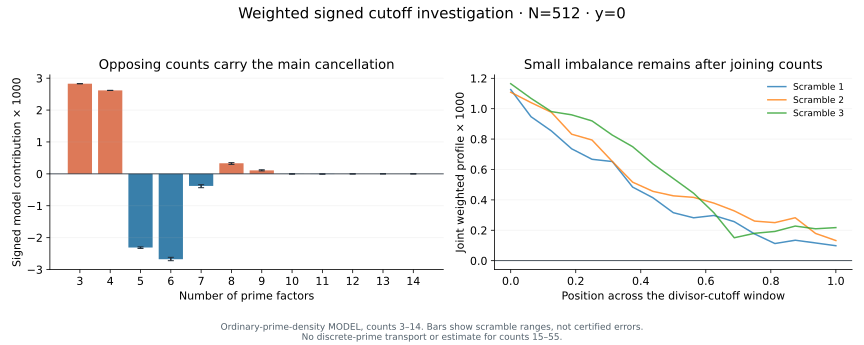

# Weighted signed cutoff profiles

The investigation adds checked arithmetic sign theorems and an optional
quantitative probe. **The retained signed prime-sum bound and complementary
floor remain open.** The exact target stays

\[
u^{N+1}\bigl(\mathrm{lowerThresholdPacket}_{3..55}
             -\mathrm{shortOverflowPacket}_{3..13}\bigr).
\]

The [proved overflow ledger](zeta-riesz-least-order-boundary.md), earlier paid
errors and every no-go remain valid. Neither displayed term receives a
separate allowance. No zero-free frontier changes.

## Checked arithmetic information

[`four_coefficient_nonneg_lowSupport`](../RiemannGaussian/ZetaRieszCutoffProfile.lean)
proves, for `u>=1/2`, `N>=2`, and every **four-prime** label on the unchanged
`ZetaRieszLeastVariation.lowSupport`,

\[
0\le\operatorname{Re}c_{L_N}(n).
\]

The coefficient is real. Multiplication by the full phase
`exp(-iy log n)` does not preserve this real sign. Original nonnegative
factorial weights remain; no extra mask or zero hypothesis is imposed.

Extract `n=P*a`. The physical cutoff and `P>=sqrt(n)` make the composite
cofactor saturated at the original length, so `R_L(n)=-R_(L-log P)(a)`.
The existing literal length bound and core lower endpoint give

\[
L_N\le2N\log2\le\frac75N,\quad
\log n>\frac{39}{20}N,\quad
2(L_N-\log P)\le\log a.
\]

The three-prime cofactor response is nonnegative below its midpoint.
This proves the four-prime sign directly on the original retained Finset.

The file also records the exact plateau identity `R_D(br)=log r` when `r`
is prime, `br` squarefree and `log r<=D<=log p` for every prime factor `p`
of `b`. This follows from existing extreme-prime deletion at the reflected
cutoff. It is not a new saving: it shows why within-label cancellation
cannot be uniformly small, since the unit middle divisor may survive alone.

There is also a concrete opposing five-prime family.
`five_coefficient_nonpos_core` proves a nonpositive coefficient for
`n=P*r*a*b*c`, with `a<b<c`, under the current core/owner/least/physical
geometry and the additional test

\[
\log P+\log r+\log a\le L_N.
\]

In the ordered factorization, `r,a` are the two smallest primes, so this is
`P*r*a<=X_N`. No prime is completed. For middle logs `A<=B<=C`, the exact
three-prime response on `A<=t<=A+C` is

\[
R_t(abc)=A-\min\{A,(t-B)_+\}-(t-C)_+.
\]

It decreases after `A` and before its midpoint. The small-pair test places
both endpoints `D-log r,D` in that decreasing interval, proving
`R_D(rabc)=R_D(abc)-R_(D-log r)(abc)<=0`. Saturated large-prime deletion
then gives the sign of the original coefficient. The Lean theorem states
every geometric premise explicitly and discharges the midpoint and saturation
from those premises. This is a pointwise arithmetic sign, not a lower bound
for the real phased carrier or a relative population estimate.

## Weighted profile experiment

With `n=P*r*b`, `T=log n`, `D=L-log P`, `h=log r`, the finite identity from
the [anatomy audit](zeta-riesz-label-anatomy.md) is

\[
c_L(n)=\frac{T}{L}\int_{D-h}^{D}M_b(t)\,dt,
\qquad M_b(t)=\sum_{d\mid b,\ \log d\le t}\mu(d).
\]

[`probe_riesz_signed_cutoff.py`](../scripts/probe_riesz_signed_cutoff.py)
measures this staircase, its signed integral, the integral of its absolute
value, and the earlier termwise divisor allowance. It checks the integral
against the independent finite clipped-hinge sum. Every distinct marked
prime is included. Counts below 14 keep both least-order endpoints; counts
14 and above keep the lower endpoint. These are the exact finite multinomial
marginals of the current target, evaluated numerically without a normal
approximation. The old allocation factor has already been independently
paid at this target.

The [JSON report](riesz-signed-cutoff-probe.json) separates two experiments.
The first uses **ordinary-prime density** `dp/log p`, with full phase, moving
integer-floor length, core window, physical endpoints, owner/least-share
interior and exact factorial probabilities. It is not an exposed-zero model:
no factor `(-1)^omega` is inserted. It evaluates counts 3--14 at
`N=256,512,1024`, using 4096 Sobol points per count and three independent
scrambles. **It does not evaluate the Lean Finset, prove prime-density
transport, or bound the omitted counts 15--55.**

At `N=512`, the scramble averages in the nonoscillatory (`y=0`) model are:

| Operation | Approximate model mass |
| --- | ---: |
| Absolute values before the middle-divisor sum | `0.108` |
| Absolute value after the signed staircase, before integration | `0.0159` |
| Absolute value after each complete profile integral | `0.0154` |
| Signed sum of all modeled counts 3--14 | `0.00051` |

Divisor signs save a substantial factor. Further integration within each
individual profile saves only a few percent. The next large saving is
**across labels and prime counts**:

| Prime count | Mean signed model contribution, `N=512`, `y=0` |
| --- | ---: |
| 3 | `+0.002827` |
| 4 | `+0.002617` |
| 5 | `-0.002310` |
| 6 | `-0.002677` |
| 7 | `-0.000378` |
| 8 | `+0.000332` |

This is not alternation by count parity. Three/four-prime labels reinforce
when their phases agree. Counts five and six supply the principal opposing
model mass; later counts still matter to the residual.



The proved small-pair condition contains about 96.7%, 98.3%, and 99.0% of
the model's **negative five-prime coefficient mass** at orders 256, 512,
and 1024 respectively, averaged over the three scrambles. These are model
coverage diagnostics, not coverage estimates for actual primes. They identify
a simple sign-certified family for an arithmetic supply estimate; they do not
justify truncating the full count sum.

| Order | Signed total range across scrambles, `y=0` |
| --- | ---: |
| 256 | `0.000667..0.000673` |
| 512 | `0.000441..0.000567` |
| 1024 | `0.000321..0.000820` |

These ranges are convergence diagnostics, **not rigorous error bars** or an
asymptotic rate. Values at heights 54, 60 and 100 retain their full phase
but vary substantially between scrambles; no floor is inferred from them.
The small `y=0` residual cannot be used at a hypothetical zero's ordinate.

The second experiment constructs actual Proth primes at randomized log
targets: 96 labels over counts 3--14 at orders 256 and 512, with exact modular
primality certificates. Distinctness, products
and the explicitly listed geometric masks are checked. Transcendental
formulas use 600-digit arithmetic; factorial probabilities use floating
point. These selected integers are **not a representative prime population**;
the script does not certify membership in the original Lean Finset.

At `N=256`, certified five-prime products give `c_L(n)/log n` approximately
`+0.04707` and `-0.04151`. The positive example is a plateau with shares
about `.55364,.17172,.12608,.11714,.03142`. Thus five-prime labels do not
have a universal negative coefficient. Exact factors, certificates, full
phases and all marked weights are recorded in the report.

## Remaining arithmetic task

A useful theorem must compare the **joint weighted cutoff imbalance** of
the actual cofactor population. Keep the canonical least prime, marked
factorial weights, original support and `exp(-iy log n)` while comparing
positive three/four-prime mass with mixed-sign five/six-prime and higher-count
mass. The new sign theorem and the model do not prove that comparison.

Existing prime-replacement and mass-transport identities already retain the
needed phases. Their missing quantitative supply/coverage estimates remain
missing. Do not replace the profile by another unsigned divisor allowance,
assume alternating prime-count signs, truncate the unpaid tail, or invoke
generic absolute PNT/Abel transport. The earlier signed target is unchanged.

Run this optional investigation outside ordinary CI:

```sh
OPENBLAS_NUM_THREADS=1 .lake/plot-venv/bin/python \
  scripts/probe_riesz_signed_cutoff.py --orders 256 512 1024 \
  --power 12 --seeds 3 --max-count 14 --certificate-cases 4 \
  --output /tmp/riesz-signed-cutoff.json
```

`--resume` retains completed diagnostics after interruption and records
previous producer hashes. No exhaustive certification workflow is invoked.
The chart is reproduced by `scripts/plot_riesz_signed_cutoff.py --input
docs/riesz-signed-cutoff-probe.json --output docs/riesz-signed-cutoff-profile.svg`.
